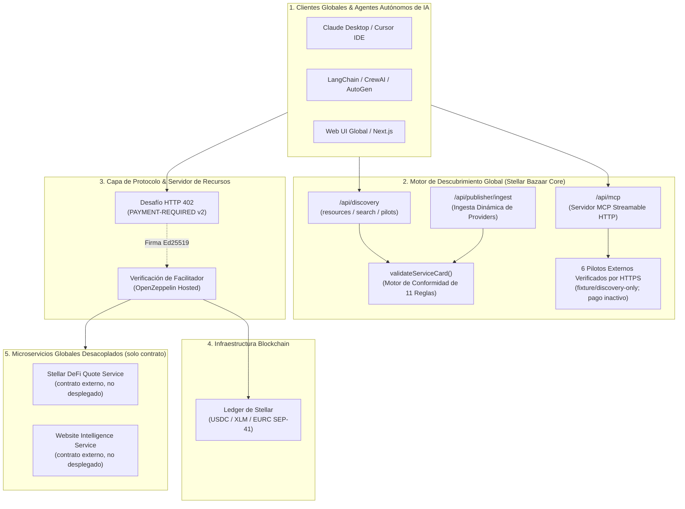
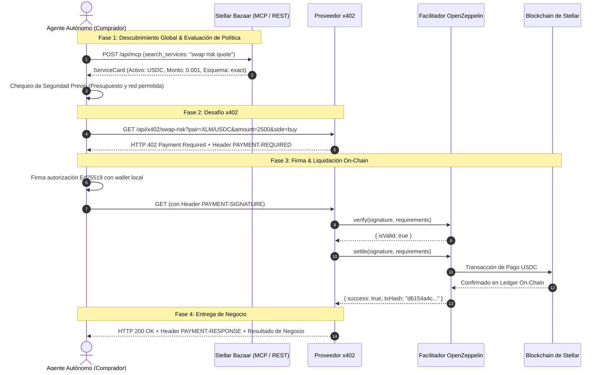

# ✦ Stellar Bazaar x402
### *Infraestructura Universal de Descubrimiento y Micropagos Atómicos x402 para la Economía Global de Agentes de IA en Stellar*

<div align="center">

[](README.md)
[](README.es.md)

<br/><br/>


</div>

[](LICENSE)
[](https://stellar.expert/explorer/testnet)
[](https://x402.org)
[](docs/AGENT_QUICKSTART.md)
[](tsconfig.json)
[](https://stellar-bazaar-x402.vercel.app)
[](https://stellar.expert/explorer/testnet)

---

## 🌟 Por Qué Importa: La Economía Global Agente a Agente (A2A)

Los **Agentes Autónomos de IA** (Claude, Cursor, LangChain, CrewAI, AutoGen) están transformando el software hacia una economía autónoma, pero se enfrentan a un **cuello de botella de infraestructura fundamental**:

> **El Problema:** Los agentes de IA no pueden tener tarjetas de crédito humanas, no pueden comprometerse a suscripciones SaaS mensuales de $50 USD para tareas individuales, y pasar claves maestras de API dentro de prompts de LLMs crea vulnerabilidades inaceptables de seguridad.

```
       [ WEB HUMANA TRADICIONAL ]                      [ INFRAESTRUCTURA GLOBAL STELLAR BAZAAR x402 ]
 ❌ Muros de pago por suscripción mensual          ✅ Micropagos atómicos por solicitud (ej. 0.001 USDC)
 ❌ Fuga de API keys maestras en prompts           ✅ Cero secretos compartidos; pago criptográfico por llamada
 ❌ Directorios cerrados centrados en humanos      ✅ Catálogo machine-readable global (MCP Streamable + REST)
 ❌ Acuerdos de servicio ambiguos                  ✅ ServiceCards deterministas con esquemas estrictos de I/O
 ❌ Intermediarios custodiales y comisiones altas  ✅ Cero custodia: liquidación on-chain directa en Stellar
```

**Stellar Bazaar x402** es la **capa global de descubrimiento y enrutamiento de pagos** que permite a agentes de IA y desarrolladores de todo el mundo descubrir, negociar y pagar por APIs HTTP y herramientas MCP bajo demanda, liquidando micropagos instantáneos y de bajo costo mediante el estándar abierto **x402 sobre la blockchain de Stellar**.

---

## 💡 ¿Por Qué Stellar + x402 para la Economía Global de Agentes?

1. **Liquidación Global Sub-Segundo & Micro-comisiones:** Transacciones liquidadas en 3–5 segundos con comisiones de red de sub-céntimo ($0.00001), habilitando micro-transacciones viables para flujos agénticos de alta frecuencia.
2. **Estándar Abierto HTTP 402:** Protocolo limpio y estandarizado `HTTP 402 Payment Required` con soporte multi-activo SEP-41 (`USDC`, `XLM`, `EURC`).
3. **Model Context Protocol (MCP) Nativo:** Descubrimiento y consumo de herramientas sin fricción para asistentes de IA (Claude Desktop, Cursor IDE, Windsurf) y frameworks (LangChain, CrewAI, AutoGen).
4. **Global por Diseño con Inteligencia Multilingüe Nativa:** Esquemas universales para máquinas y búsqueda semántica con coincidencia de intención cross-idioma.

---

## 🏗️ Arquitectura del Sistema



---

## 🔄 Flujo de Interacción: Descubrir, Pagar y Ejecutar

> **Visor interactivo del contrato:** `/payment-flow` visualiza descubrir → quote → 402 → política del buyer → liquidación → entrega → recibo sin firma, acceso a wallet, llamadas al proveedor ni pagos. Esta rama borrador permanece local/preview hasta su revisión. Consulta [el contrato de la máquina de estados](docs/BUYER_PROVIDER_PAYMENT_FLOW.md).



---

## 💎 Estado Actual del Proyecto & Evidencia en Vivo

> **Límite actual:** el discovery de producción está activo y existe evidencia
> histórica de liquidación x402 en Stellar Testnet. Bazaar **no tiene un smart
> contract propio desplegado, escrow, reparto de comisión, flujo de pagos Mainnet
> ni proceso público de disputas**. El modelo propuesto de listado, brief del
> comprador, promesa visual, Service Registry y escrow limitado está documentado
> como trabajo futuro en [Modelo futuro de listado, compra y escrow](docs/LISTING_PURCHASE_ESCROW_FUTURE.md).

### 🟢 Liquidaciones On-Chain Verificadas (Stellar Testnet)

| # | Cuándo | Método | Tx Interna (Soroban) | Ledger | Delta Seller |
|---|--------|--------|----------------------|--------|--------------|
| 1 | 2026-08-18 20:36Z | `x402:test-client` | [`43f3ea34…013602`](https://stellar.expert/explorer/testnet/tx/43f3ea344b5ba0f4e0de88237f91c765adc90c110827282320bd3b7aa2013602) | `4212660` | `+0.0010000 USDC` |
| 2 | 2026-08-18 | `x402:test-client` | [`4d6b26ca…86ae11`](https://stellar.expert/explorer/testnet/tx/4d6b26cad5fea174824599467fe885593837517461b72ec7a6e8461e2286ae11) | `4214612` | `+0.0010000 USDC` |
| 3 | 2026-08-18 | `agent:quickstart` | [`5ff5f2d3…a89c2`](https://stellar.expert/explorer/testnet/tx/5ff5f2d34fc09bb9d0b5953c0d6fe9d1a0771f81eee53676b1c47c64e02a89c2) | `4214711` | `+0.0010000 USDC` |
| 4 | 2026-08-19 02:31Z | `agent:quickstart` | [`235d6ffd…87cb49`](https://stellar.expert/explorer/testnet/tx/235d6ffdfd36b27a831668b868014536d47e32128d950c89fd07ed415587cb49) | `4216913` | `+0.0010000 USDC` |
| 5 | 2026-08-19 07:43Z | `agent:quickstart` | [`c7fa7d18…03b625`](https://stellar.expert/explorer/testnet/tx/c7fa7d18d036b19be969d37e393da8a8b8aa9f70dc8e111e4568d90dd903b625) | `4220649` | `+0.0010000 USDC` |

Todas: `stellar:testnet`, scheme `exact`, `0.001 USDC` (`10000` atomic), contrato SEP-41 `CBIELTK6YBZJU5UP2WWQEUCYKLPU6AUNZ2BQ4WWFEIE3USCIHMXQDAMA`, payer [`GC3CK5A4…VDL4`](https://stellar.expert/explorer/testnet/account/GC3CK5A4KCNE44LGMU6PYPEAAZVQOFATJCEMBAASGCXK5EKECTB2VDL4) → recipient [`GDVR2KDK5…RMCQ`](https://stellar.expert/explorer/testnet/account/GDVR2KDK5DSMNYZJKNISUIOBDC6FZK3XZOIQWSS7KL4BRMD5BMW6RMCQ). La primera incluye además su [Tx Fee-Bump exterior](https://horizon-testnet.stellar.org/transactions/4498c958c148b98d6b9424168e12eea43352f3bb12a56558d30f50984563f05f) con patrocinio de OpenZeppelin (`GA6THKUY...`).

### ✅ Hitos Completados y Verificados

1. **Despliegue en Producción (Vercel):**
   * Live en `https://stellar-bazaar-x402.vercel.app` con key de facilitador server-only y persistencia en Upstash Redis en Production + Preview.
   * Hub de Desarrolladores interactivo (`/docs`) con snippets en 1 clic para Claude Desktop MCP, TypeScript SDK, Python LangChain/CrewAI y cURL.
2. **Servidor MCP Streamable HTTP (`/api/mcp`, v0.5.0):**
   * 7 herramientas de sólo lectura: `get_bazaar_capabilities`, `list_services`, `search_services`, `get_service`, `validate_service_card`, `list_workflow_bundles`, `get_workflow_bundle`. MCP no anuncia escrituras, pagos, firma, ejecución ni custodia.
   * `search_services` con paginación por cursor opaco (`limit` 1–50, `nextCursor`, `partialResults`) y envelopes deterministas (`RESOURCE_NOT_FOUND`, `INVALID_CURSOR`, `BUNDLE_NOT_FOUND`).
   * Cards registrados por providers visibles en `list_services`/`search_services`/`get_service` y persistidos entre redeploys vía Upstash Redis (provisionado 2026-08-19; verificado tras redeploys de producción).
3. **SDK Oficial para Agentes & Kit Python (`lib/bazaar-agent-client.ts` & `docs/LANGCHAIN_CREWAI.md`):**
   * SDK fuertemente tipado para discovery/políticas. La ejecución pagada dinámica falla de forma cerrada sin un verificador independiente que concilie red, asset, monto y destino.
4. **Auto-Registro de Proveedores & Plantilla de Inicio Rápido (`/api/publisher/ingest` & `docs/FAST_PROVIDER_START.md`):**
   * Borrador local y validación determinista en `/publish`. El alta real es append-only, server-to-server, deshabilitada por defecto y exige activación explícita, Redis durable y credencial de operador.
5. **Contrato de Proveedor Externo y Validación E2E:**
   * Registro transparente para repositorios independientes de cotización y endpoints MCP de solo lectura. Ver [evidencia externa E2E](docs/EXTERNAL_PROVIDER_E2E.md) y [capacidades MCP](docs/MCP_DISCOVERY.md).
6. **6 Pilotos Externos Verificados por HTTPS:**
   * Inteligencia Web, Creador de Campañas, Explorador de Investigación, Reutilización de Video, Brief de Diseño y Estudio de Identidad de Marca.
   * Cada card bilingüe enlaza su repositorio y deployment públicos, fija el commit validado y declara `fixture-live` o `discovery-only`. Los pagos están inactivos y no se inventa precio. Consulta el [informe QA HTTPS puntual](docs/VERIFIED_PROVIDER_QA.md) y el [plan de inclusión](docs/PROVIDER_CATALOG_PLAN.md).
7. **Workflow Bundles — Schema y Fixtures (solo lectura):**
   * `bazaar.workflow-bundle/v1` con 20 reglas deterministas (19 activas para fixtures ready/draft) (ciclos, gates, artifacts, precio) y 2 bundles fixture. Ver [WORKFLOW_BUNDLES_FUTURE.md](docs/internal/WORKFLOW_BUNDLES_FUTURE.md).
8. **Baterías de Pruebas Automatizadas (cero riesgo de fondos):**
   * Ecosistema 5-en-1, onboarding MCP (paginación + corpus hostil), workflow bundles (13 casos negativos), seguridad de agentes, ingesta de publishers, external provider CI/mock y suites de contrato público.

---

## 🚀 Inicio Rápido (Quickstart)

### 1. Instalación y Ejecución Local

Requisitos: Node.js 22.18+ y npm.

```bash
# Clonar el repositorio
git clone https://github.com/CaBsCrypto/stellar-bazaar-x402.git
cd stellar-bazaar-x402

# Instalar dependencias
npm install

# Iniciar servidor Next.js
npm run dev
```

Abre `http://localhost:3000` en tu navegador.

---

### 2. Ejecutar la Batería de Pruebas

```bash
# Validar tipos TypeScript estrictos (0 errores)
npm run typecheck

# Compilar build de producción
npm run build

# Ejecutar el arnés E2E del ecosistema (REST + MCP + x402, cero riesgo de fondos)
npm run test:e2e:ecosystem

# Ejecutar onboarding MCP (7 tools read-only + rechazo de mutaciones)
npm run test:mcp:onboarding

# Ejecutar el corpus de evaluación de políticas de agente (12 escenarios: metadata hostil, traversal, fidelity de estados, sin fugas de secretos)
npm run test:agent:policy:evals

# Ejecutar el benchmark de ranking reproducible (golden set, gates NDCG@3 / MRR / Recall@3)
npm run benchmark:ranking

# Ejecutar la suite de conformance de workflow bundles (13 casos negativos)
npm run test:workflow:bundle

# Ejecutar la suite de seguridad y hard-caps de agentes
npm run test:agent:safety

# Verificar registro fail-closed y conformance disponible
npm run test:publisher:ingest

# Verificar hash profundo, payer retirado y conciliación de recibos
npm run test:security:invariants

# Ejecutar la validación del contrato de proveedor externo (mock + CI)
npm run test:e2e:external

# Ejecutar el smoke de protocolo x402 (challenge, capabilities, no transaccional)
npm run test:x402:protocol

# Ejecutar la suite del contrato público del proveedor (offline, sin fondos)
npm run test:contract:external:public

# Ejecutar el E2E real del proveedor externo en testnet (requiere RUN_EXTERNAL_X402_TESTNET=1 + EXTERNAL_QUOTE_BASE_URL)
npm run test:e2e:external:testnet

# Ejecutar discovery/política read-only (sin pago)
npm run agent:quickstart

# Ejecutar el runner de pago validado y reconciliación de recibo
npm run agent:paid-execution

# Ejecutar el test de integración E2E de los 3 actores (Proveedor + Bazaar + Comprador)
npm run test:three-actors:e2e
```

---

### 3. Conexión de Agentes de IA en 3 Líneas de Código

```typescript
import { BazaarAgentClient } from "@/lib/bazaar-agent-client";

// 1. Inicializar cliente read-only con límites de política
const client = new BazaarAgentClient({
  baseUrl: "http://localhost:3000",
  maxPriceAllowedUsdc: 0.05,
  allowedAssets: ["USDC"],
});

// 2. Descubrir el servicio deseado vía MCP
const [serviceCard] = await client.searchServicesMCP("swap risk");

// 3. Inspeccionar. Ejecutar/pagar exige payer server-only y receiptVerifier;
// un tx hash por sí solo nunca se acepta como prueba de settlement.
console.log("Service card:", serviceCard);
console.log("Recibo Stellar:", execution.payment.receiptUrl);
```

---

## 🛡️ Fronteras de Seguridad y Confianza (Trust & Safety)

* **Cero Custodia:** Bazaar jamás almacena, retiene ni custodia fondos de usuarios o agentes.
* **Cero Firma de Llaves:** La firma y consentimiento residen 100% del lado del cliente/wallet (`server-only`).
* **Sin Intermediación de Secretos:** Las ServiceCards no contienen API keys, tokens ni claves privadas (`S...`).
* **Metadata No Confiable:** Las descripciones siguen siendo datos no confiables; URL y route template reciben checks deterministas de SSRF/traversal.
* **Protección Anti-Bucle (Circuit Breakers):** Máximo de 1 reintento con pago por ciclo para prevenir bucles de cobro involuntarios.
* **Sin Escrow Hoy:** La evidencia x402 actual usa liquidación directa. Cualquier escrow futuro debe ser un contrato opt-in, separado y auditado; no está activo en este despliegue.

---

## 🗺️ Hoja de Ruta (Roadmap)

```
 [ FASE 1: COMPLETADA ]        [ FASE 2: VALIDADA ]          [ FASE 3: SEGURIDAD ]        [ FASE 4: FUTURA ]
  Discovery UI & REST API   --> Evidencia x402 Testnet   --> MCP read-only + SDK      --> Ownership + multiactivo
  Servidor MCP Streamable       Prueba on-chain histórica    Registro fail-closed         Mainnet sólo tras auditoría
```

1. ✅ **Fase 1 (Discovery Core):** Catálogo global, ranking determinista, servidor MCP y validador de ServiceCards.
2. ✅ **Fase 2 (Liquidación Testnet):** Reto HTTP 402, firmas Ed25519 y liquidación on-chain con `@x402/stellar`.
3. 🟡 **Fase 3 (Remediación de seguridad):** MCP read-only, gate de conciliación, hashes profundos, payer retirado y registro append-only deshabilitado por defecto.
4. ⚪ **Fase 4 (Futura):** Service Registry controlado por proveedor, promesas visuales y briefs del comprador, reglas limitadas por compra para escrow/liberación/reembolso, splits de comisión transparentes, multiactivo SEP-41 y Mainnet sólo tras auditoría externa independiente.

---

## 📖 Documentación Relacionada

* [**Versión en Inglés (`README.md`)**](README.md)
* [**Guía de Inicio (`GETTING_STARTED.md`)**](docs/GETTING_STARTED.md)
* [**Guía de Integración para Agentes (`AGENT_QUICKSTART.md`)**](docs/AGENT_QUICKSTART.md)
* [**Guía de Reproducción Testnet (`DEMO_TESTNET.md`)**](docs/DEMO_TESTNET.md)
* [**Referencia de Variables de Entorno (`ENVIRONMENT_VARIABLES.md`)**](docs/ENVIRONMENT_VARIABLES.md)
* [**Referencia de la API HTTP (`HTTP_API_REFERENCE.md`)**](docs/HTTP_API_REFERENCE.md)
* [**Configuración de Cliente MCP (`MCP_CLIENT_SETUP.md`)**](docs/MCP_CLIENT_SETUP.md)
* [**Reglas de Conformidad (`CONFORMANCE_RULES.md`)**](docs/CONFORMANCE_RULES.md)
* [**FAQ de Solución de Problemas (`TROUBLESHOOTING_FAQ.md`)**](docs/TROUBLESHOOTING_FAQ.md)
* [**Onboarding de Agentes MCP (`MCP_AGENT_ONBOARDING.md`)**](docs/MCP_AGENT_ONBOARDING.md)
* [**Descubrimiento y Capacidades MCP (`MCP_DISCOVERY.md`)**](docs/MCP_DISCOVERY.md)
* [**Evidencia E2E Proveedor Externo (`EXTERNAL_PROVIDER_E2E.md`)**](docs/EXTERNAL_PROVIDER_E2E.md)
* [**Especificación del Contrato de Discovery (`DISCOVERY_CONTRACT.md`)**](docs/internal/DISCOVERY_CONTRACT.md)
* [**Biblia del Proyecto & Arquitectura (`PROJECT_BIBLE.md`)**](docs/internal/PROJECT_BIBLE.md)
* [**Paginación MCP & Backlog P1 (`MCP_DISCOVERY_BACKLOG.md`)**](docs/internal/MCP_DISCOVERY_BACKLOG.md)
* [**Workflow Bundles Futuro (`WORKFLOW_BUNDLES_FUTURE.md`)**](docs/internal/WORKFLOW_BUNDLES_FUTURE.md)
* [**Modelo de Listado, Compra & Escrow Futuro (`LISTING_PURCHASE_ESCROW_FUTURE.md`)**](docs/LISTING_PURCHASE_ESCROW_FUTURE.md)

> Los documentos internos & históricos (propuestas, backlogs, security/QA) viven en [`docs/internal/`](docs/internal/).

---

## 📄 Licencia

Este proyecto y su documentación están licenciados bajo **[Apache-2.0](LICENSE)**.
Las dependencias externas conservan sus respectivas licencias.
