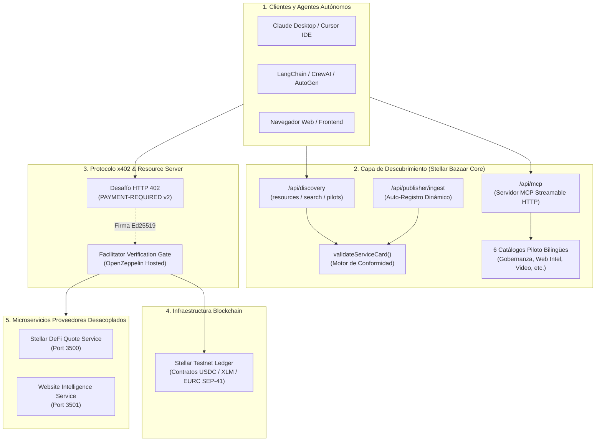

# ✦ Stellar Bazaar x402
### *Catálogo de Descubrimiento Inteligente y Micropagos Atómicos x402 para Agentes de IA en Stellar*

<div align="center">

[](README.md)
[](README.es.md)

</div>

[](LICENSE)
[](https://stellar.expert/explorer/testnet)
[](https://x402.org)
[](docs/AGENT_QUICKSTART.md)
[](tsconfig.json)

---

## 🌟 Pitch Ejecutivo: La Nueva Economía Agente-a-Agente (A2A)

Los **agentes de Inteligencia Artificial autónomos** (Claude, Cursor, LangChain, CrewAI, AutoGen) están revolucionando el software, pero enfrentan un **cuello de botella crítico**:

> **El Dilema:** Los agentes no tienen tarjetas de crédito humanas, no pueden suscribirse a planes SaaS mensuales recurrentes de $50/mes para una sola consulta, y compartir API keys maestras representa un riesgo de seguridad inaceptable.

```
       [ EL PROBLEMA ACTUAL ]                          [ LA SOLUCIÓN STELLAR BAZAAR x402 ]
 ❌ Paywalls con suscripción humana mensual        ✅ Micropagos atómicos por llamada (ej. 0.001 USDC)
 ❌ Fuga de API keys maestras en prompts           ✅ Cero llaves compartidas; pago directo por llamada
 ❌ Directorios cerrados o perfiles humanos        ✅ Catálogo legible por máquinas (MCP + REST)
 ❌ Falta de acuerdos de nivel de servicio        ✅ ServiceCards con esquemas I/O y precios deterministas
 ❌ Custodia de fondos y comisiones abusivas       ✅ Cero custodia de fondos: liquidación directa en Stellar
```

**Stellar Bazaar x402** es la capa de **descubrimiento y catálogo inteligente** que conecta a compradores y agentes de IA con APIs HTTP y herramientas MCP de pago, liquidando micropagos instantáneos y de bajo costo a través del protocolo abierto **x402 sobre la red Stellar**.

---

## 💡 ¿Por Qué Stellar + x402?

1. **Velocidad y Comisiones Ultra-bajas:** Transacciones liquidadas en 3-5 segundos con comisiones de red despreciables ($0.00001), ideales para llamadas de alta frecuencia de agentes.
2. **Estándar Abierto x402 v2:** Devuelve `HTTP 402 Payment Required` estándar del W3C con especificación de activo SEP-41 y monto.
3. **Model Context Protocol (MCP) Nativo:** Compatible directamente con asistentes como Claude Desktop, Cursor IDE y frameworks como LangChain y CrewAI.
4. **Enfoque Spanish-First con Paridad Global:** Metadatos, categorías y documentación diseñados prioritariamente en español con paridad exacta en inglés (`es` / `en`).

---

## 🏗️ Arquitectura del Sistema



---

## 🔄 Flujo de Interacción: Descubrir, Pagar y Ejecutar


---

## 💎 Estado Actual del Proyecto & Evidencia en Vivo

### 🟢 Hitos Completados y Verificados

1. **Liquidación On-Chain en Stellar Testnet Verificada:**
   * **Hash de Transacción:** [`d6154a4c60607bac76309462d109c85031f66710dfe22fe603cada4d41e78094`](https://stellar.expert/explorer/testnet/tx/d6154a4c60607bac76309462d109c85031f66710dfe22fe603cada4d41e78094)
   * **Ledger Confirmado:** `4202242`
   * **Monto:** `0.001 USDC` (`10000` stroops)
   * **Contrato SEP-41:** `CBIELTK6YBZJU5UP2WWQEUCYKLPU6AUNZ2BQ4WWFEIE3USCIHMXQDAMA`
2. **Servidor MCP Streamable HTTP (`/api/mcp`):**
   * 5 herramientas estándar: `get_bazaar_capabilities`, `list_services`, `search_services`, `get_service`, `validate_service_card`.
3. **SDK Oficial para Agentes (`lib/bazaar-agent-client.ts`):**
   * SDK fuertemente tipado para interactuar, evaluar políticas de gasto y auto-liquidar pagos x402 en 3 líneas de código.
4. **Auto-Registro de Proveedores (`/api/publisher/ingest`):**
   * Registro dinámico con verificación determinista de 11 reglas de conformidad.
5. **6 Pilotos Bilingües Estructurados:**
   * Gobernanza de Agentes (`agent-policy-pilot`), Inteligencia Web, Reutilización de Video, Creador de Campañas, Explorador de Investigación y Brief de Diseño.
6. **Arnés de Pruebas Automatizado 5-en-1 (`scripts/test-e2e-ecosystem.mjs`):**
   * Validación integral de punta a punta con **cero riesgo de fondos**.

---

## 🚀 Inicio Rápido (Quickstart)

### 1. Instalación y Ejecución Local

```bash
# Clonar el repositorio
git clone https://github.com/CaBsCrypto/stellar-bazaar-x402.git
cd stellar-bazaar-x402

# Instalar dependencias
npm install

# Iniciar servidor Next.js
npm run dev
```

Abre `http://localhost:3000` en tu navegador.

---

### 2. Ejecutar la Batería de Pruebas

```bash
# Validar tipos TypeScript estrictos (0 errores)
npm run typecheck

# Ejecutar el arnés E2E del ecosistema (REST + MCP + x402)
npm run test:e2e:ecosystem

# Ejecutar la suite de seguridad y hard-caps de agentes
npm run test:agent:safety

# Ejecutar el test de ingesta y auto-registro de proveedores
npm run test:publisher:ingest

# Ejecutar la simulación del comprador autónomo
npm run agent:quickstart
```

---

### 3. Conexión de Agentes de IA en 3 Líneas de Código

```typescript
import { BazaarAgentClient } from "@/lib/bazaar-agent-client";

// 1. Inicializar cliente con clave de Testnet y límite de presupuesto
const client = new BazaarAgentClient({
  baseUrl: "http://localhost:3000",
  payerSecretKey: process.env.X402_PAYER_SECRET,
  maxPriceAllowedUsdc: 0.05,
});

// 2. Descubrir el servicio deseado vía MCP
const [serviceCard] = await client.searchServicesMCP("riesgo swap");

// 3. Ejecutar con auto-liquidación x402
const execution = await client.executeService(serviceCard, {
  pair: "XLM/USDC",
  amount: 2500,
  side: "buy",
});

console.log("Resultado:", execution.data);
console.log("Recibo Stellar:", execution.payment.receiptUrl);
```

---

## 🛡️ Fronteras de Seguridad y Confianza (Trust & Safety)

* **Cero Custodia:** Bazaar jamás almacena, retiene ni custodia fondos de usuarios o agentes.
* **Cero Firma de Llaves:** La firma y consentimiento residen 100% del lado del cliente/wallet (`server-only`).
* **Sin Intermediación de Secretos:** Las ServiceCards no contienen API keys, tokens ni claves privadas (`S...`).
* **Metadata No Confiable:** Toda entrada, descripción y plantilla de ruta se valida y sanitiza contra inyecciones SSRF y path traversal (`..`, `@`, `#`).
* **Protección Anti-Bucle (Circuit Breakers):** Máximo de 1 reintento con pago por ciclo para prevenir bucles de cobro involuntarios.

---

## 🗺️ Hoja de Ruta (Roadmap)

```
 [ FASE 1: COMPLETADA ]        [ FASE 2: COMPLETADA ]        [ FASE 3: COMPLETADA ]       [ FASE 4: EN CURSO ]
  Discovery UI & REST API   --> Liquidación Testnet x402 --> Ingesta de Proveedores  --> Soporte Multiactivo
  Servidor MCP Streamable       Evidencia On-Chain Real       SDK & Quickstarts Agentes     Mainnet & Auditoría
```

1. ✅ **Fase 1 (Discovery Core):** Catálogo bilingüe, ranking determinista, servidor MCP y validador de ServiceCards.
2. ✅ **Fase 2 (Liquidación Testnet):** Reto HTTP 402, firmas Ed25519 y liquidación on-chain con `@x402/stellar`.
3. ✅ **Fase 3 (SDK & Ingesta):** `BazaarAgentClient`, suite de seguridad, auto-registro `/api/publisher/ingest` y arnés E2E.
4. 🟡 **Fase 4 (Expansión & Producción):** Soporte multiactivo SEP-41 (`USDC`, `XLM`, `EURC`), despliegue global y preparación para Mainnet tras auditoría externa.

---

## 📖 Documentación Relacionada

* [**Guía de Integración para Agentes (`AGENT_QUICKSTART.md`)**](docs/AGENT_QUICKSTART.md)
* [**Guía de Reproducción Testnet (`DEMO_TESTNET.md`)**](docs/DEMO_TESTNET.md)
* [**Especificación del Contrato de Discovery (`DISCOVERY_CONTRACT.md`)**](docs/DISCOVERY_CONTRACT.md)
* [**Biblia del Proyecto & Arquitectura (`PROJECT_BIBLE.md`)**](docs/PROJECT_BIBLE.md)
* [**Onboarding de Agentes MCP (`MCP_AGENT_ONBOARDING.md`)**](docs/MCP_AGENT_ONBOARDING.md)

---

## 📄 Licencia

Este proyecto y su documentación están licenciados bajo **[Apache-2.0](LICENSE)**.
Las dependencias externas conservan sus respectivas licencias.
