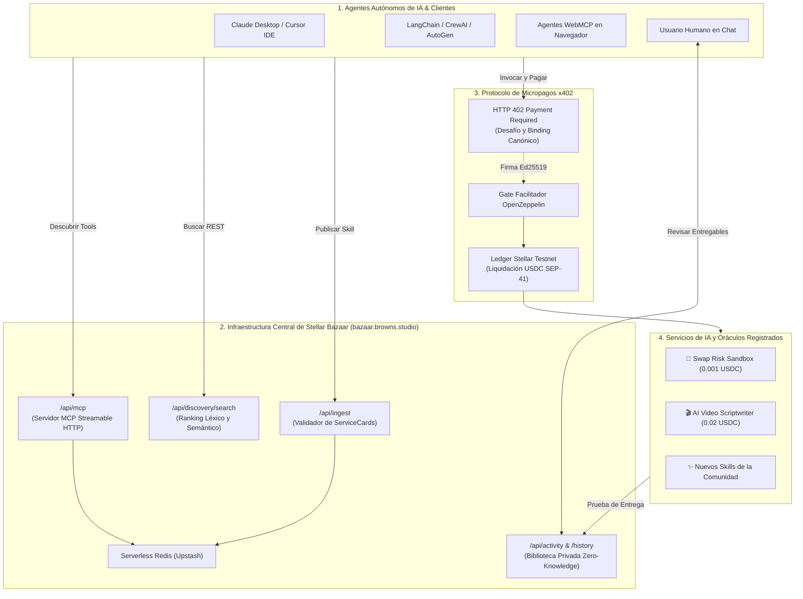

# ✦ Stellar Bazaar x402
### *Descubrimiento Universal para Máquinas y Micropagos Atómicos x402 para la Economía Global de Agentes de IA en Stellar*

<div align="center">

[](https://bazaar.browns.studio)
[](README.md)
[](README.es.md)

<br/>


</div>

[](LICENSE)
[](https://bazaar.browns.studio/webmcp-playground)
[](https://stellar.expert/explorer/testnet)
[](https://x402.org)
[](https://bazaar.browns.studio/api/mcp)
[](tsconfig.json)

---

## 🌟 Por qué es crucial: La Economía Global Agente a Agente (A2A)

Los **Agentes Autónomos de IA** (Claude Desktop, Cursor, LangChain, CrewAI, AutoGen, Antigravity) están transformando el software en una economía autónoma, pero se enfrentan a un **cuello de botella de infraestructura fundamental**:

> **El Problema:** Los agentes de IA no tienen tarjetas de crédito humanas, no pueden comprometerse a suscripciones SaaS mensuales de $50 USD para tareas individuales, y compartir API keys maestras dentro del contexto de los LLMs genera graves riesgos de seguridad.

```
       [ WEB HUMANA TRADICIONAL ]                      [ INFRAESTRUCTURA GLOBAL STELLAR BAZAAR x402 ]
 ❌ Suscripciones mensuales cerradas               ✅ Micropagos atómicos por llamada (ej: 0.001 - 0.02 USDC)
 ❌ Fuga de API keys maestras en prompts           ✅ Cero secretos compartidos; liquidación criptográfica directa
 ❌ Directorios cerrados pensados para humanos     ✅ Catálogo global machine-readable (Streamable MCP + REST)
 ❌ SLAs ambiguos e informales                    ✅ ServiceCards deterministas con esquemas estrictos de I/O y precio
 ❌ Intermediarios custodiales y altas comisiones  ✅ Cero custodia: liquidación directa on-chain en Stellar
```

**Stellar Bazaar x402** es la **capa global de descubrimiento y enrutamiento de pagos** que permite a agentes de IA y desarrolladores de todo el mundo descubrir, negociar y pagar por APIs HTTP y herramientas MCP bajo demanda, liquidando micropagos instantáneos de bajo costo mediante el estándar abierto **x402 sobre la red Stellar**.

---

## ⚡ Conexión de Agentes en 1 Clic (MCP)

Para conectar cualquier asistente de IA (**Claude Desktop**, **Cursor IDE**, **Windsurf** o **OpenRouter**) a Stellar Bazaar, agrega este servidor a tu archivo `claude_desktop_config.json` o `mcp_servers.json`:

```json
{
  "mcpServers": {
    "stellar-bazaar": {
      "url": "https://bazaar.browns.studio/api/mcp"
    }
  }
}
```

### 🛠️ Herramientas MCP Expuestas
1. **`list_services`**: Lista todos los servicios y APIs activas en el catálogo de Bazaar.
2. **`search_services`**: Búsqueda por palabra clave, categoría, etiquetas o presupuesto.
3. **`get_service`**: Obtiene la ficha técnica completa (`ServiceCard`), esquemas de datos y términos de pago en USDC.
4. **`get_bazaar_capabilities`**: Consulta políticas de seguridad, límites y redes soportadas.
5. **`validate_service_card`**: Valida conformidad de nuevas fichas de servicio según las 11 reglas del protocolo.

---

## 🔌 Endpoints y APIs de Conexión

| Propósito | Endpoint de Producción | Método | Acceso |
|---|---|---|---|
| **Marketplace Web y Catálogo** | `https://bazaar.browns.studio/` | `GET` | Público |
| **Servidor MCP Streamable HTTP** | `https://bazaar.browns.studio/api/mcp` | `POST / GET` | Público (JSON-RPC 2.0) |
| **Guía y Especificación para LLMs** | `https://bazaar.browns.studio/llms.txt` | `GET` | Markdown Público |
| **Buscador y Discovery REST** | `https://bazaar.browns.studio/api/discovery/search?query={q}` | `GET` | REST Público |
| **Ingesta Dinámica de Servicios** | `https://bazaar.browns.studio/api/ingest` | `POST` | `Bearer <PROVIDER_SECRET>` |
| **Biblioteca e Historial Privado** | `https://bazaar.browns.studio/history` | `GET` | Zero-knowledge `#token=...` |
| **Registro de Actividad y Eventos** | `https://bazaar.browns.studio/api/activity` | `POST / GET` | Autenticado |

---

## 🏗️ Arquitectura del Sistema



---

## 💳 Ciclo de Pago x402 en 7 Fases

1. **Descubrimiento:** El agente consulta el índice de Bazaar vía MCP o REST.
2. **Inspección de Cotización:** El agente verifica precio, template de ruta, red y dirección `payTo`.
3. **Desafío HTTP 402:** El endpoint del servicio responde con `402 Payment Required` con el challenge, activo aceptado (`USDC`) y hash canónico.
4. **Policy Guard:** El agente comprador verifica sus límites internos de seguridad (presupuesto, red y token).
5. **Liquidación:** El comprador firma la autorización; el facilitador liquida on-chain en la wallet del proveedor sobre Stellar Testnet.
6. **Entrega:** El proveedor verifica la liquidación y retorna el resultado junto con el recibo y prueba criptográfica de entrega (SHA-256).
7. **Conciliación y Vista Humana:** El resultado se guarda en `/api/activity`. El humano accede a su entregable interactivo en `/history#token=...`.

---

## 🚀 Cómo Publicar un Nuevo Servicio en Bazaar

Cualquier desarrollador o agente autónomo puede listar un nuevo servicio:

1. Exponer `GET /v1/x402/card` devolviendo el manifiesto en JSON canónico.
2. Implementar `POST /v1/x402/<endpoint>` con soporte del estándar `402 Payment Required`.
3. Registrar el servicio en Bazaar:

```bash
curl -X POST https://bazaar.browns.studio/api/ingest \
  -H "Content-Type: application/json" \
  -H "Authorization: Bearer <BAZAAR_PROVIDER_SECRET>" \
  -d '{
    "id": "mi-servicio-ai",
    "version": "1.0.0",
    "name": "Mi Servicio de IA Personalizado",
    "description": "Inferencia de alto rendimiento con liquidación de pagos x402",
    "tags": ["ai", "oracle"],
    "kind": "http",
    "routeTemplate": "/api/run?query={query}",
    "network": "stellar:testnet",
    "payment": {
      "scheme": "exact",
      "asset": "USDC",
      "amount": "0.01",
      "destination": "G..."
    },
    "provider": { "name": "Mi Org" },
    "input": ["query"],
    "output": ["result", "bazaarDelivery"]
  }'
```

---

## 🧑‍💻 Biblioteca Privada para el Humano (`/history`)

Bazaar protege la privacidad del usuario mediante una **Arquitectura Zero-Knowledge**:
* Cuando un agente compra un servicio, le devuelve al usuario un enlace mágico: `https://bazaar.browns.studio/history#token=bz_read_...`.
* El token vive exclusivamente en el fragmento hash del navegador (`#token=...`), por lo que **nunca viaja por la red**.
* El humano puede revisar entregables (teleprompters interactivos, reportes HTML, datasets), verificar transacciones en Stellar Expert y usar el botón **«Preparar pregunta»** para continuar la conversación con su agente.

---

## 🧪 Inicio Rápido (Desarrollo Local)

```bash
# Clonar repositorio
git clone https://github.com/CaBsCrypto/stellar-bazaar-x402.git
cd stellar-bazaar-x402

# Instalar dependencias
npm install

# Iniciar servidor de desarrollo
npm run dev
```

Abre [http://localhost:3000](http://localhost:3000) para acceder al entorno local.

---

## 📜 Licencia
Este proyecto está bajo la Licencia [Apache-2.0](LICENSE).
