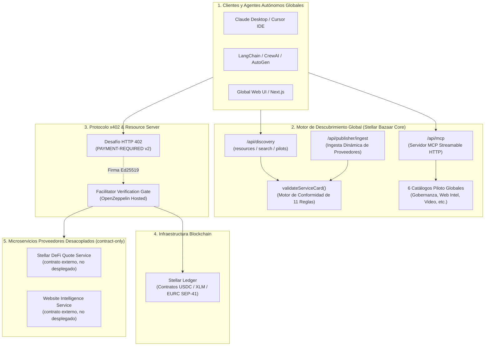
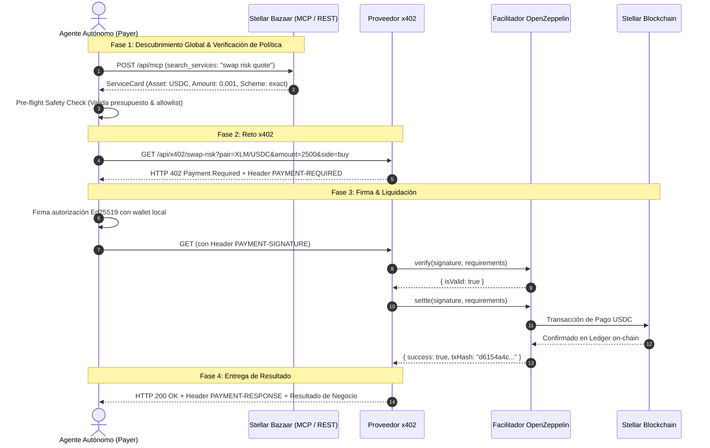

# ✦ Stellar Bazaar x402
### *Infraestructura Universal de Descubrimiento y Micropagos Atómicos x402 para la Economía Global de Agentes de IA en Stellar*

<div align="center">

[](README.md)
[](README.es.md)

<br/><br/>


</div>

[](LICENSE)
[](https://stellar.expert/explorer/testnet)
[](https://x402.org)
[](docs/AGENT_QUICKSTART.md)
[](tsconfig.json)
[](https://stellar-bazaar-x402.vercel.app)
[](https://stellar.expert/explorer/testnet)

---

## 🌟 Por Qué Importa: La Economía Global Agente-a-Agente (A2A)

Los **agentes de Inteligencia Artificial autónomos** (Claude, Cursor, LangChain, CrewAI, AutoGen) están transformando el software en una economía autónoma, pero enfrentan un **cuello de botella crítico de infraestructura**:

> **El Problema:** Los agentes no tienen tarjetas de crédito humanas, no pueden suscribirse a planes SaaS mensuales recurrentes de $50/mes para una sola consulta, y compartir API keys maestras en los prompts representa un riesgo inaceptable de seguridad.

```
       [ LA WEB HUMANA TRADICIONAL ]                   [ INFRAESTRUCTURA GLOBAL STELLAR BAZAAR x402 ]
 ❌ Paywalls con suscripción mensual humana        ✅ Micropagos atómicos por llamada (ej. 0.001 USDC)
 ❌ Fuga de API keys maestras en prompts           ✅ Cero llaves compartidas; pago criptográfico directo por llamada
 ❌ Directorios cerrados orientados a humanos      ✅ Catálogo legible por máquinas global (Streamable MCP + REST)
 ❌ Acuerdos de servicio ambiguos                  ✅ ServiceCards deterministas con esquemas estrictos de I/O y precio
 ❌ Intermediarios con custodia y comisiones altas ✅ Cero custodia: liquidación directa on-chain en Stellar
```

**Stellar Bazaar x402** es la **capa global de descubrimiento y enrutamiento de pagos** que permite a compradores y agentes de IA de todo el mundo descubrir, negociar y pagar por APIs HTTP y herramientas MCP bajo demanda, liquidando micropagos instantáneos a través del estándar abierto **x402 sobre la red Stellar**.

---

## 💡 ¿Por Qué Stellar + x402 para la Economía Global de Agentes?

1. **Velocidad de Liquidación Global & Comisiones Despreciables:** Liquidación en 3-5 segundos a nivel mundial con comisiones de red despreciables ($0.00001), habilitando microtransacciones de alta frecuencia para agentes.
2. **Estándar Abierto HTTP 402:** Protocolo estandarizado `HTTP 402 Payment Required` con soporte multiactivo SEP-41 (`USDC`, `XLM`, `EURC`).
3. **Model Context Protocol (MCP) Nativo:** Conexión sin fricción para asistentes de IA globales (Claude Desktop, Cursor IDE, Windsurf) y frameworks (LangChain, CrewAI, AutoGen).
4. **Global por Diseño con Inteligencia Multilingüe Nativa:** Esquemas universales legibles por máquinas con coincidencia de intención entre múltiples idiomas.

---

## 🏗️ Arquitectura del Sistema



---

## 🔄 Flujo de Interacción: Descubrir, Pagar y Ejecutar



---

## 💎 Estado Actual del Proyecto & Evidencia en Vivo

### 🟢 Liquidaciones On-Chain Verificadas (Stellar Testnet)

| # | Cuándo | Método | Tx Interna (Soroban) | Ledger | Delta Seller |
|---|--------|--------|----------------------|--------|--------------|
| 1 | 2026-08-18 20:36Z | `x402:test-client` | [`43f3ea34…013602`](https://stellar.expert/explorer/testnet/tx/43f3ea344b5ba0f4e0de88237f91c765adc90c110827282320bd3b7aa2013602) | `4212660` | `+0.0010000 USDC` |
| 2 | 2026-08-18 | `x402:test-client` | [`4d6b26ca…86ae11`](https://stellar.expert/explorer/testnet/tx/4d6b26cad5fea174824599467fe885593837517461b72ec7a6e8461e2286ae11) | `4214612` | `+0.0010000 USDC` |
| 3 | 2026-08-18 | `agent:quickstart` | [`5ff5f2d3…a89c2`](https://stellar.expert/explorer/testnet/tx/5ff5f2d34fc09bb9d0b5953c0d6fe9d1a0771f81eee53676b1c47c64e02a89c2) | `4214711` | `+0.0010000 USDC` |

Todas: `stellar:testnet`, scheme `exact`, `0.001 USDC` (`10000` atomic), contrato SEP-41 `CBIELTK6YBZJU5UP2WWQEUCYKLPU6AUNZ2BQ4WWFEIE3USCIHMXQDAMA`, payer [`GC3CK5A4…VDL4`](https://stellar.expert/explorer/testnet/account/GC3CK5A4KCNE44LGMU6PYPEAAZVQOFATJCEMBAASGCXK5EKECTB2VDL4) → recipient [`GDVR2KDK5…RMCQ`](https://stellar.expert/explorer/testnet/account/GDVR2KDK5DSMNYZJKNISUIOBDC6FZK3XZOIQWSS7KL4BRMD5BMW6RMCQ). La primera incluye además su [Tx Fee-Bump exterior](https://horizon-testnet.stellar.org/transactions/4498c958c148b98d6b9424168e12eea43352f3bb12a56558d30f50984563f05f) con patrocinio de OpenZeppelin (`GA6THKUY...`).

### ✅ Hitos Completados y Verificados

1. **Despliegue en Producción (Vercel):**
   * Live en `https://stellar-bazaar-x402.vercel.app` con key de facilitador server-only regenerada (2026-08-18) y dirección del seller en Production + Preview.
   * Smoke post-deploy: landing/publish/MCP/discovery/reference → 200; x402 sin pago → 402 + `PAYMENT-REQUIRED` v2; suites ecosystem/MCP/agent/publisher/workflow re-ejecutadas contra la URL pública.
2. **Servidor MCP Streamable HTTP (`/api/mcp`, v0.4.0):**
   * 11 herramientas: `get_bazaar_capabilities`, `list_services`, `search_services`, `get_service`, `validate_service_card`, `list_workflow_bundles`, `get_workflow_bundle`, más escrituras de registro `register_service`, `update_service`, `delete_service`, `list_my_services` (auth por secret compartido vía `providerKey`).
   * `search_services` con paginación por cursor opaco (`limit` 1–50, `nextCursor`, `partialResults`) y envelopes de error deterministas (`RESOURCE_NOT_FOUND`, `INVALID_CURSOR`, `BUNDLE_NOT_FOUND`, `UNAUTHORIZED`, `CARD_EXISTS`, `VALIDATION_FAILED`, `STORAGE_ERROR`).
   * Cards registrados por providers visibles en `list_services`/`search_services`/`get_service` y persistidos entre redeploys (Upstash Redis pendiente de provisionar — fallback en memoria hasta entonces).
3. **SDK Oficial para Agentes (`lib/bazaar-agent-client.ts`):**
   * SDK fuertemente tipado para interactuar, evaluar políticas de gasto y auto-liquidar pagos x402 en 3 líneas de código.
4. **Auto-Registro de Proveedores (`/api/publisher/ingest`):**
   * Registro dinámico con verificación determinista de 11 reglas de conformidad y validación completa de forma (zod).
   * Ciclo de vida completo: `POST` (crear, 409 `CARD_EXISTS` en duplicados), `PUT`/`DELETE` `/api/publisher/ingest/{id}` (actualizar/eliminar, con `revision`), `GET` (listar tus cards). Auth con `X-Bazaar-Provider-Key` (secret compartido; dev-open sin `BAZAAR_PROVIDER_SECRET`, prod fail-closed 503).
   * Persistencia Upstash Redis (`UPSTASH_REDIS_REST_URL`/`UPSTASH_REDIS_REST_TOKEN`) con fallback en memoria — **pendiente de provisionar (2026-08-18)**; hasta entonces los cards no sobreviven redeploys. Flujo humano en `/publish`. Ver [PROVIDER_ONBOARDING.md](docs/PROVIDER_ONBOARDING.md).
5. **Contrato de Proveedor Externo y Validación E2E:**
   * Registro transparente para repositorios independientes de cotización y endpoints MCP de solo lectura. Ver [evidencia externa E2E](docs/EXTERNAL_PROVIDER_E2E.md) y [capacidades MCP](docs/MCP_DISCOVERY.md).
6. **6 Pilotos Globales Estructurados:**
   * Gobernanza de Agentes (`agent-policy-pilot`), Inteligencia Web, Reutilización de Video, Creador de Campañas, Explorador de Investigación y Brief de Diseño.
7. **Workflow Bundles — Schema y Fixtures (solo lectura):**
   * `bazaar.workflow-bundle/v1` con 20 reglas deterministas (19 activas para fixtures ready/draft) (ciclos, gates, artifacts, precio) y 2 bundles fixture. Ver [WORKFLOW_BUNDLES_FUTURE.md](docs/internal/WORKFLOW_BUNDLES_FUTURE.md).
8. **Baterías de Pruebas Automatizadas (cero riesgo de fondos):**
   * Ecosistema 5-en-1, onboarding MCP (paginación + corpus hostil), workflow bundles (13 casos negativos), seguridad de agentes, ingesta de publishers, external provider CI/mock y suites de contrato público.

---

## 🚀 Inicio Rápido (Quickstart)

### 1. Instalación y Ejecución Local

Requisitos: Node.js 22.18+ y npm.

```bash
# Clonar el repositorio
git clone https://github.com/CaBsCrypto/stellar-bazaar-x402.git
cd stellar-bazaar-x402

# Instalar dependencias
npm install

# Iniciar servidor Next.js
npm run dev
```

Abre `http://localhost:3000` en tu navegador.

---

### 2. Ejecutar la Batería de Pruebas

```bash
# Validar tipos TypeScript estrictos (0 errores)
npm run typecheck

# Compilar build de producción
npm run build

# Ejecutar el arnés E2E del ecosistema (REST + MCP + x402, cero riesgo de fondos)
npm run test:e2e:ecosystem

# Ejecutar la suite de onboarding MCP (11 tools, paginación, ciclo de vida vía MCP)
npm run test:mcp:onboarding

# Ejecutar la suite de conformance de workflow bundles (13 casos negativos)
npm run test:workflow:bundle

# Ejecutar la suite de seguridad y hard-caps de agentes
npm run test:agent:safety

# Ejecutar la suite de onboarding de providers (ciclo de vida, auth, forma, persistencia)
npm run test:publisher:ingest

# Ejecutar la validación del contrato de proveedor externo (mock + CI)
npm run test:e2e:external

# Ejecutar el smoke de protocolo x402 (challenge, capabilities, no transaccional)
npm run test:x402:protocol

# Ejecutar la suite del contrato público del proveedor (offline, sin fondos)
npm run test:contract:external:public

# Ejecutar el E2E real del proveedor externo en testnet (requiere RUN_EXTERNAL_X402_TESTNET=1 + EXTERNAL_QUOTE_BASE_URL)
npm run test:e2e:external:testnet

# Ejecutar la simulación del comprador autónomo (liquidación REAL de 0.001 USDC testnet)
npm run agent:quickstart
```

---

### 3. Conexión de Agentes de IA en 3 Líneas de Código

```typescript
import { BazaarAgentClient } from "@/lib/bazaar-agent-client";

// 1. Inicializar cliente con clave de Testnet y límite de presupuesto
const client = new BazaarAgentClient({
  baseUrl: "http://localhost:3000",
  payerSecretKey: process.env.X402_PAYER_SECRET,
  maxPriceAllowedUsdc: 0.05,
});

// 2. Descubrir el servicio deseado vía MCP
const [serviceCard] = await client.searchServicesMCP("swap risk");

// 3. Ejecutar con auto-liquidación x402
const execution = await client.executeService(serviceCard, {
  pair: "XLM/USDC",
  amount: 2500,
  side: "buy",
});

console.log("Resultado:", execution.data);
console.log("Recibo Stellar:", execution.payment.receiptUrl);
```

---

## 🛡️ Fronteras de Seguridad y Confianza (Trust & Safety)

* **Cero Custodia:** Bazaar jamás almacena, retiene ni custodia fondos de usuarios o agentes.
* **Cero Firma de Llaves:** La firma y consentimiento residen 100% del lado del cliente/wallet (`server-only`).
* **Sin Intermediación de Secretos:** Las ServiceCards no contienen API keys, tokens ni claves privadas (`S...`).
* **Metadata No Confiable:** Toda entrada, descripción y plantilla de ruta se valida y sanitiza contra inyecciones SSRF y path traversal (`..`, `@`, `#`).
* **Protección Anti-Bucle (Circuit Breakers):** Máximo de 1 reintento con pago por ciclo para prevenir bucles de cobro involuntarios.

---

## 🗺️ Hoja de Ruta (Roadmap)

```
 [ FASE 1: COMPLETADA ]        [ FASE 2: COMPLETADA ]        [ FASE 3: COMPLETADA ]       [ FASE 4: EN CURSO ]
  Discovery UI & REST API   --> Liquidación Testnet x402 --> Ingesta de Proveedores  --> Soporte Multiactivo
  Servidor MCP Streamable       Evidencia On-Chain Real       SDK & Quickstarts Agentes     Ejecución Workflows & Mainnet
```

1. ✅ **Fase 1 (Discovery Core):** Catálogo global, ranking determinista, servidor MCP y validador de ServiceCards.
2. ✅ **Fase 2 (Liquidación Testnet):** Reto HTTP 402, firmas Ed25519 y liquidación on-chain con `@x402/stellar`.
3. ✅ **Fase 3 (SDK & Ingesta):** `BazaarAgentClient`, suite de seguridad, auto-registro `/api/publisher/ingest` y arnés E2E.
4. 🟡 **Fase 4 (Expansión & Producción):** Producción Vercel live ✅, paginación por cursor MCP ✅, schema de workflow bundles ✅. Pendiente: ejecución multiactivo SEP-41 (`XLM`, `EURC`), ejecución de bundles con gates, red de proveedores externos y preparación para Mainnet tras auditoría externa.

---

## 📖 Documentación Relacionada

* [**Versión en Inglés (`README.md`)**](README.md)
* [**Guía de Inicio (`GETTING_STARTED.md`)**](docs/GETTING_STARTED.md)
* [**Guía de Integración para Agentes (`AGENT_QUICKSTART.md`)**](docs/AGENT_QUICKSTART.md)
* [**Guía de Reproducción Testnet (`DEMO_TESTNET.md`)**](docs/DEMO_TESTNET.md)
* [**Referencia de Variables de Entorno (`ENVIRONMENT_VARIABLES.md`)**](docs/ENVIRONMENT_VARIABLES.md)
* [**Referencia de la API HTTP (`HTTP_API_REFERENCE.md`)**](docs/HTTP_API_REFERENCE.md)
* [**Configuración de Cliente MCP (`MCP_CLIENT_SETUP.md`)**](docs/MCP_CLIENT_SETUP.md)
* [**Reglas de Conformidad (`CONFORMANCE_RULES.md`)**](docs/CONFORMANCE_RULES.md)
* [**FAQ de Solución de Problemas (`TROUBLESHOOTING_FAQ.md`)**](docs/TROUBLESHOOTING_FAQ.md)
* [**Onboarding de Agentes MCP (`MCP_AGENT_ONBOARDING.md`)**](docs/MCP_AGENT_ONBOARDING.md)
* [**Descubrimiento y Capacidades MCP (`MCP_DISCOVERY.md`)**](docs/MCP_DISCOVERY.md)
* [**Evidencia E2E Proveedor Externo (`EXTERNAL_PROVIDER_E2E.md`)**](docs/EXTERNAL_PROVIDER_E2E.md)
* [**Especificación del Contrato de Discovery (`DISCOVERY_CONTRACT.md`)**](docs/internal/DISCOVERY_CONTRACT.md)
* [**Biblia del Proyecto & Arquitectura (`PROJECT_BIBLE.md`)**](docs/internal/PROJECT_BIBLE.md)
* [**Paginación MCP & Backlog P1 (`MCP_DISCOVERY_BACKLOG.md`)**](docs/internal/MCP_DISCOVERY_BACKLOG.md)
* [**Workflow Bundles Futuro (`WORKFLOW_BUNDLES_FUTURE.md`)**](docs/internal/WORKFLOW_BUNDLES_FUTURE.md)

> Los documentos internos & históricos (propuestas, backlogs, security/QA) viven en [`docs/internal/`](docs/internal/).

---

## 📄 Licencia

Este proyecto y su documentación están licenciados bajo **[Apache-2.0](LICENSE)**.
Las dependencias externas conservan sus respectivas licencias.
