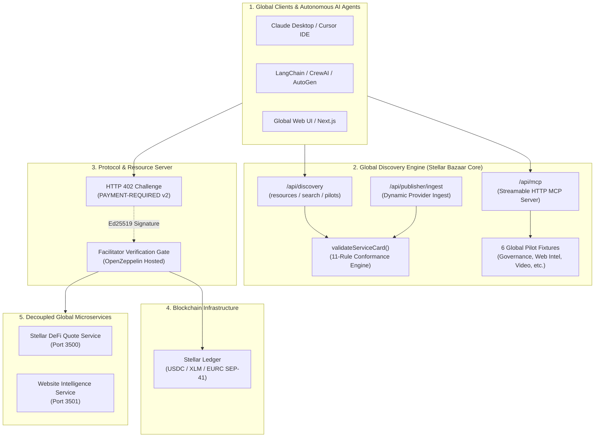
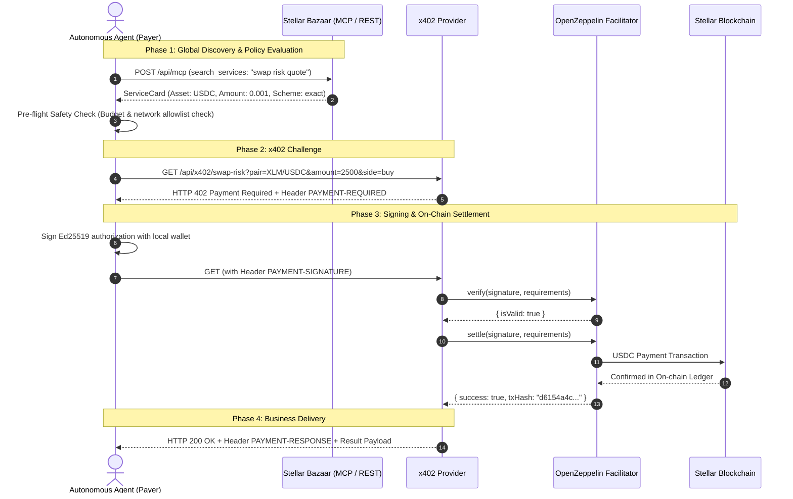

# ✦ Stellar Bazaar x402
### *Universal Machine-Readable Discovery & Atomic x402 Micropayments for the Global AI Agent Economy on Stellar*

<div align="center">

[](README.md)
[](README.es.md)

<br/><br/>


</div>

[](LICENSE)
[](https://stellar.expert/explorer/testnet)
[](https://x402.org)
[](docs/AGENT_QUICKSTART.md)
[](tsconfig.json)

---

## 🌟 Executive Pitch: The Global Agent-to-Agent (A2A) Economy

Autonomous **AI Agents** (Claude, Cursor, LangChain, CrewAI, AutoGen) are rapidly transforming software into an autonomous economy, but they face a **fundamental infrastructure bottleneck**:

> **The Problem:** AI Agents cannot hold human credit cards, cannot commit to $50/month recurring SaaS subscription tiers for single-task executions, and passing master API keys inside LLM prompts creates unacceptable security liabilities.

```
       [ LEGACY HUMAN WEB ]                            [ STELLAR BAZAAR x402 GLOBAL INFRASTRUCTURE ]
 ❌ Monthly human subscription paywalls            ✅ Atomic per-request micropayments (e.g. 0.001 USDC)
 ❌ Master API key leaks in prompt context         ✅ Zero shared secrets; direct cryptographic payment per call
 ❌ Human-centric closed service directories       ✅ Global machine-readable catalog (Streamable MCP + REST)
 ❌ Ambiguous service level agreements             ✅ Deterministic ServiceCards with strict I/O & pricing schemas
 ❌ Custodial middlemen and high fees              ✅ Zero custody: direct on-chain settlement on Stellar
```

**Stellar Bazaar x402** is the **global discovery and payment routing layer** that enables autonomous AI agents and developers worldwide to discover, negotiate, and pay for HTTP APIs and MCP tools on demand, settling instant, low-cost micropayments via the open **x402 standard on the Stellar blockchain**.

---

## 💡 Why Stellar + x402 for the Global Agent Economy?

1. **Sub-second Global Settlement & Micro-fees:** Settle transactions in 3–5 seconds worldwide with near-zero network fees ($0.00001), unlocking viable high-frequency micro-transactions for autonomous agent workflows.
2. **Open Standard HTTP 402:** Clean, standardized `HTTP 402 Payment Required` protocol flow with SEP-41 multi-asset specification (`USDC`, `XLM`, `EURC`).
3. **Native Model Context Protocol (MCP):** Zero-friction tool discovery and consumption for global AI assistants (Claude Desktop, Cursor IDE, Windsurf) and orchestration frameworks (LangChain, CrewAI, AutoGen).
4. **Global by Design with Native Multilingual Intelligence:** Universal machine-readable schemas and semantic discovery supporting international queries with cross-language intent matching.

---

## 🏗️ System Architecture



---

## 🔄 Interaction Flow: Discover, Pay & Execute



---

## 💎 Project Status & Live On-Chain Evidence

### 🟢 Completed & Verified Milestones

1. **Verified On-Chain Settlement on Stellar:**
   * **Outer (Fee-Bump) Tx Hash:** [`4498c958c148b98d6b9424168e12eea43352f3bb12a56558d30f50984563f05f`](https://horizon-testnet.stellar.org/transactions/4498c958c148b98d6b9424168e12eea43352f3bb12a56558d30f50984563f05f)
   * **Inner Soroban Transfer Tx Hash (Stellar Expert):** [`43f3ea344b5ba0f4e0de88237f91c765adc90c110827282320bd3b7aa2013602`](https://stellar.expert/explorer/testnet/tx/43f3ea344b5ba0f4e0de88237f91c765adc90c110827282320bd3b7aa2013602)
   * **Confirmed Ledger:** `4212660` (Timestamp: `2026-08-18T20:36:25Z`)
   * **Payer Account:** [`GC3CK5A4KCNE44LGMU6PYPEAAZVQOFATJCEMBAASGCXK5EKECTB2VDL4`](https://stellar.expert/explorer/testnet/account/GC3CK5A4KCNE44LGMU6PYPEAAZVQOFATJCEMBAASGCXK5EKECTB2VDL4)
   * **Recipient Account:** [`GDVR2KDK5DSMNYZJKNISUIOBDC6FZK3XZOIQWSS7KL4BRMD5BMW6RMCQ`](https://stellar.expert/explorer/testnet/account/GDVR2KDK5DSMNYZJKNISUIOBDC6FZK3XZOIQWSS7KL4BRMD5BMW6RMCQ)
   * **Amount:** `0.001 USDC` (`10000` stroops)
   * **SEP-41 Contract:** `CBIELTK6YBZJU5UP2WWQEUCYKLPU6AUNZ2BQ4WWFEIE3USCIHMXQDAMA`
   * **Facilitator Sponsorship:** OpenZeppelin Fee-Bump relayer (`GA6THKUY...`)
2. **Second Verified On-Chain Settlement (2026-08-18):**
   * **Inner Soroban Transfer Tx Hash:** [`4d6b26cad5fea174824599467fe885593837517461b72ec7a6e8461e2286ae11`](https://stellar.expert/explorer/testnet/tx/4d6b26cad5fea174824599467fe885593837517461b72ec7a6e8461e2286ae11)
   * **Same parties/amount:** payer `GC3CK5A4...VDL4` → recipient `GDVR2KDK5...RMCQ`, `0.001 USDC` exact; seller delta `+0.0010000 USDC` verified on Horizon.
3. **Production Deployment (Vercel):**
   * Live at `https://stellar-bazaar-x402.vercel.app` with server-only facilitator key (regenerated 2026-08-18) and seller address in Production + Preview.
   * Post-deploy smoke: landing/publish/MCP/discovery/reference → 200; unpaid x402 → 402 + `PAYMENT-REQUIRED` v2; ecosystem/MCP/agent/publisher suites re-run against the public URL.
4. **Streamable HTTP MCP Server (`/api/mcp`):**
   * 7 standard RFC tools: `get_bazaar_capabilities`, `list_services`, `search_services`, `get_service`, `validate_service_card`, plus read-only `list_workflow_bundles` / `get_workflow_bundle` (composition fixtures, `execution:false`).
   * `search_services` supports opaque cursor pagination (`limit` 1–50, `nextCursor`, `partialResults`) and deterministic error envelopes (`RESOURCE_NOT_FOUND`, `INVALID_CURSOR`, `BUNDLE_NOT_FOUND`).
3. **Official Agent SDK (`lib/bazaar-agent-client.ts`):**
   * Strongly typed SDK for agent discovery, pre-flight safety policy checks, and automated x402 payment handling in 3 lines of code.
4. **Dynamic Provider Ingest API (`/api/publisher/ingest`):**
   * Deterministic registration with 11-rule conformance engine and strict injection prevention.
5. **External Provider Contract & E2E Validation:**
   * Truthful contract-only record for independent quote repositories and read-only MCP discovery endpoints. See [external E2E evidence](docs/EXTERNAL_PROVIDER_E2E.md) and [MCP capabilities](docs/MCP_DISCOVERY.md).
6. **6 Global Pilot Bundles:**
   * Agent Governance & Policy (`agent-policy-pilot`), Website Intelligence, Video Repurpose, Campaign Builder, Research Scout, and Design Brief.
7. **Workflow Bundle Schema & Fixtures (read-only):**
   * `bazaar.workflow-bundle/v1` with 15 deterministic conformance rules (cycles, gates, artifacts, price) and 2 fixture bundles. See [WORKFLOW_BUNDLES_FUTURE.md](docs/WORKFLOW_BUNDLES_FUTURE.md).
8. **Automated 5-in-1 E2E Test Suite (`scripts/test-e2e-ecosystem.mjs`):**
   * Complete end-to-end ecosystem validation with **zero fund risk**.

---

## 🚀 Quickstart

### 1. Installation & Local Run

Requirements: Node.js 20+ and npm.

```bash
# Clone the repository
git clone https://github.com/CaBsCrypto/stellar-bazaar-x402.git
cd stellar-bazaar-x402

# Install dependencies
npm install

# Start Next.js development server
npm run dev
```

Open `http://localhost:3000` in your browser.

---

### 2. Run Test Batteries

```bash
# Validate strict TypeScript types (0 errors)
npm run typecheck

# Run Next.js production build
npm run build

# Run ecosystem E2E test suite (REST + MCP + x402)
npm run test:e2e:ecosystem

# Run autonomous agent safety & budget hard-caps suite
npm run test:agent:safety

# Run dynamic provider ingestion suite
npm run test:publisher:ingest

# Run autonomous agent buyer flow demo
npm run agent:quickstart
```

---

### 3. Connect AI Agents in 3 Lines of Code

```typescript
import { BazaarAgentClient } from "@/lib/bazaar-agent-client";

// 1. Initialize client with testnet secret and hard-cap safety limit
const client = new BazaarAgentClient({
  baseUrl: "http://localhost:3000",
  payerSecretKey: process.env.X402_PAYER_SECRET,
  maxPriceAllowedUsdc: 0.05,
});

// 2. Discover target service via MCP tool call
const [serviceCard] = await client.searchServicesMCP("swap risk");

// 3. Execute with automatic x402 settlement
const execution = await client.executeService(serviceCard, {
  pair: "XLM/USDC",
  amount: 2500,
  side: "buy",
});

console.log("Result:", execution.data);
console.log("Stellar Receipt:", execution.payment.receiptUrl);
```

---

## 🛡️ Trust & Security Boundaries

* **Non-Custodial:** Stellar Bazaar never holds, custodies, or escrows user or agent funds.
* **Client-Side Signing Only:** Private keys (`S...`) reside exclusively on local client runtime environments (`server-only`).
* **Zero Secret Leakage:** ServiceCards never contain API keys or secrets.
* **Untrusted Metadata Defense:** All descriptions, inputs, and route templates are strictly validated and sanitized against SSRF and traversal attacks (`..`, `@`, `#`).
* **Loop Protection Circuit Breakers:** Strict 1-retry payment limit per HTTP request to prevent infinite payment loops.

---

## 🗺️ Roadmap

```
 [ PHASE 1: COMPLETED ]        [ PHASE 2: COMPLETED ]        [ PHASE 3: COMPLETED ]       [ PHASE 4: IN PROGRESS ]
  Discovery UI & REST API   --> Testnet x402 Settlement  --> Dynamic Provider Ingest --> Multi-Asset Support (XLM/EURC)
  Streamable MCP Server         Real On-Chain Evidence        Agent SDK & Safety Suite    Mainnet Deployment & Audit
```

1. ✅ **Phase 1 (Discovery Core):** Global catalog, deterministic lexical ranking, MCP streamable server, and ServiceCard validator.
2. ✅ **Phase 2 (Testnet Settlement):** HTTP 402 challenge, Ed25519 signature verification, and on-chain settlement via `@x402/stellar`.
3. ✅ **Phase 3 (Agent SDK & Ingest):** `BazaarAgentClient`, safety hard-caps, `/api/publisher/ingest` auto-registry, and E2E harness.
4. 🟡 **Phase 4 (Expansion & Production):** SEP-41 multi-asset support (`USDC`, `XLM`, `EURC`), cloud production deployment, and Mainnet readiness.

---

## 📖 Documentation & Guides

* [**Versión en Español (`README.es.md`)**](README.es.md)
* [**Agent Integration Quickstart (`docs/AGENT_QUICKSTART.md`)**](docs/AGENT_QUICKSTART.md)
* [**Testnet Reproduction Guide (`docs/DEMO_TESTNET.md`)**](docs/DEMO_TESTNET.md)
* [**Discovery Contract Specification (`docs/DISCOVERY_CONTRACT.md`)**](docs/DISCOVERY_CONTRACT.md)
* [**Project Architecture Bible (`docs/PROJECT_BIBLE.md`)**](docs/PROJECT_BIBLE.md)
* [**MCP Agent Onboarding (`docs/MCP_AGENT_ONBOARDING.md`)**](docs/MCP_AGENT_ONBOARDING.md)

---

## 📄 License

This project and its documentation are licensed under **[Apache-2.0](LICENSE)**.
Third-party dependencies retain their respective licenses.
