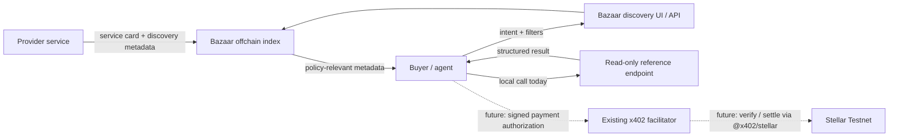
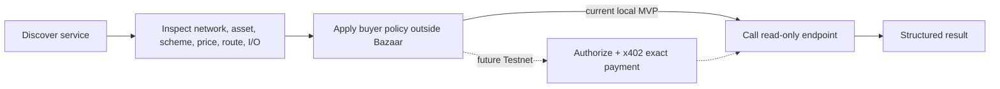
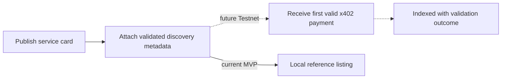

# Stellar Bazaar x402


**Spanish-first discovery for paid HTTP APIs and MCP tools on Stellar.**

**Live MVP:** [stellar-bazaar-x402.vercel.app](https://stellar-bazaar-x402.vercel.app) · [Publisher Kit](https://stellar-bazaar-x402.vercel.app/publish)

Provider/agent onboarding in this branch: `/onboarding`. Read-only MCP discovery: `/api/mcp` (claim as live only after branch deployment verification). See [agent onboarding](docs/MCP_AGENT_ONBOARDING.md) and [provider onboarding](docs/PROVIDER_ONBOARDING.md).

Future design only: [Workflow Bundles / Paquetes de capacidades](docs/WORKFLOW_BUNDLES_FUTURE.md) describes objective-oriented compositions without claiming orchestration, custody, employment, or paid multi-service execution.

The hosted site is a public preview of the same local-MVP scope: discovery, conformance, provider drafts, and the read-only reference endpoint. It does **not** enable live x402 payments, wallets, signatures, or Stellar transactions.

Stellar Bazaar x402 is an open-source proof of concept for finding paid services, inspecting their machine-readable terms, and eventually invoking them through x402 settlement on Stellar. Bazaar indexes **services and callable routes**—not people, agent profiles, freelancers, or generic skills.

> **Current status:** Testnet-validated MVP. Discovery (REST & Streamable MCP), catalogue navigation, bilingual pilot fixtures (including Agent Governance & Policy), and deterministic Swap Risk Quote work locally. Real `exact` USDC micropayments over Stellar Testnet via `@x402/stellar` and OpenZeppelin Facilitator are fully verified on-chain.

## What it is—and is not

Bazaar is a discovery/catalogue layer that exposes service metadata so buyers and agents can make informed choices before calling a provider. The default index is intended to remain offchain.

It is **not** a wallet, escrow, freelancer marketplace, Passport, agent-profile marketplace, generic skills directory, custodian, or buyer-policy engine. It complements rather than competes with Carmelita, a separate multichain trust/payment product that could consume Bazaar as a client later.

## Working MVP

- Spanish-first responsive landing and searchable HTTP/MCP catalogue with complete English metadata parity.
- 6 bilingual pilot fixtures (including *Website Intelligence*, *Video Repurpose*, and *Agent Governance & Policy*).
- Service details with route template, inputs, outputs, network, asset, scheme, and declared price.
- Live `exact` x402 payment flow on `stellar:testnet` (USDC SEP-41) verified on-chain via OpenZeppelin facilitator.
- Deterministic read-only Swap Risk Quote with structured `200`, `400`, and `402` responses.
- Streamable MCP discovery server at `/api/mcp` with 5 standard tools (`get_bazaar_capabilities`, `list_services`, `search_services`, `get_service`, `validate_service_card`).
- Deterministic natural-language ranking with visible scores/reasons and structured filters.
- Local Publisher Kit at `/publish` that validates and generates copyable service-card manifests.
- Discovery APIs at `/api/discovery/resources`, `/api/discovery/pilots`, and `/api/discovery/search`.
- Unified zero-fund-risk E2E test harness (`scripts/test-e2e-ecosystem.mjs`) covering all 5 protocol and discovery stages.
- Decoupled standalone provider architecture tested with external microservices.

The reference provider is intentionally in-process for delivery speed and is marked for extraction into a separate service after the MVP.

## Architecture



Bazaar does not sign or custody. The future facilitator boundary consumes Apache-2.0 `@x402/stellar`; this project will not reimplement its verify/settle logic.

## Buyer / agent flow



## Provider flow



## Run locally

Para reproducir el flujo x402 exact validado exclusivamente en Stellar Testnet, consulta [docs/DEMO_TESTNET.md](docs/DEMO_TESTNET.md). El sitio público actual sigue siendo el MVP de discovery; esta rama no está desplegada en producción.

Requirements: Node.js 20+ and npm.

```bash
npm install
npm run dev
```

Open `http://localhost:3000`. The working service is at `/resources/swap-risk-quote`; its endpoint is:

```text
GET /api/reference/swap-risk?pair=XLM%2FUSDC&amount=2500&side=buy
```

Providers can open `/publish` to create a local, non-indexed draft. They retain pricing, payment destination, service terms, and responsibility for delivering results. Automatic indexing is future work and will require a valid x402 discovery extension—not a form submission.

Discovery examples:

```text
GET /api/discovery/resources?kind=http&scheme=exact&maxPrice=0.03
GET /api/discovery/search?query=riesgo%20swap&kind=http
```

Validation:

```bash
npm run typecheck
npm run build
```

## Security and trust boundaries

- Bazaar does not custody funds or maintain buyer balances.
- Bazaar never signs payment authorizations; consent belongs to the buyer client/wallet.
- Bazaar exposes metadata but does not enforce buyer allowlists, budgets, or approval policy.
- The current endpoint is deterministic, read-only, bounded, and informational—not financial advice.
- No secrets or environment configuration are required for this MVP.
- Real payment claims require conformance evidence; production/pubnet claims additionally require security review and audit.
- OpenZeppelin Relayer/plugin AGPL code is not a code or dependency base for this project.

## Roadmap

1. **Completed:** discovery UI & REST API, catalogue contracts, deterministic local Swap Risk Quote.
2. **Completed:** `exact` payment on `stellar:testnet` using OpenZeppelin facilitator and `@x402/stellar` (USDC default, live on-chain settlements verified).
3. **Current / Hardening:** validated PaymentPayload extensions, route-template integrity, evaluated search/ranking, standalone decoupled provider testing (`stellar-defi-quote-service`, `website-intelligence-service`).
4. **Facilitator:** permissively licensed self-hostable `/verify`, `/settle`, `/supported` only after auth-entry security and conformance work.
5. **Later:** Stellar `upto`, arbitrary SEP-41 tokens, pubnet/mainnet, operational readiness, external audit, and upstream contribution.

## Documentation

- [Project bible](docs/PROJECT_BIBLE.md)
- [RFP coverage matrix](docs/RFP_COVERAGE.md)
- [Architecture diagrams](docs/ARCHITECTURE.md)
- [Proposal outline](docs/PROPOSAL_OUTLINE.md)
- [Discovery contract draft](docs/DISCOVERY_CONTRACT.md)
- [MCP discovery surface](docs/MCP_DISCOVERY.md)

## Deployment

The public MVP is deployed at [https://stellar-bazaar-x402.vercel.app](https://stellar-bazaar-x402.vercel.app) and connected to this GitHub repository. Production deployments track the repository through Vercel Git integration. You can also run the exact project locally using the steps above.

## License

Project code and original documentation are licensed under [Apache-2.0](LICENSE). Dependencies retain their respective licenses.
