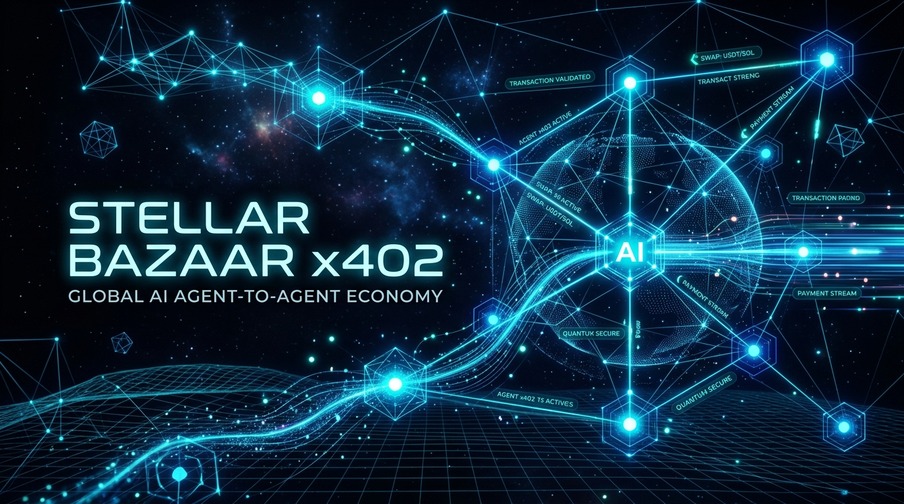
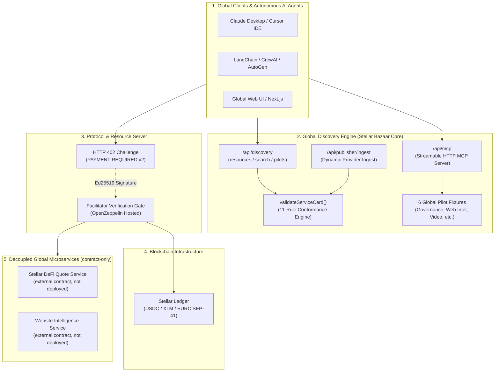
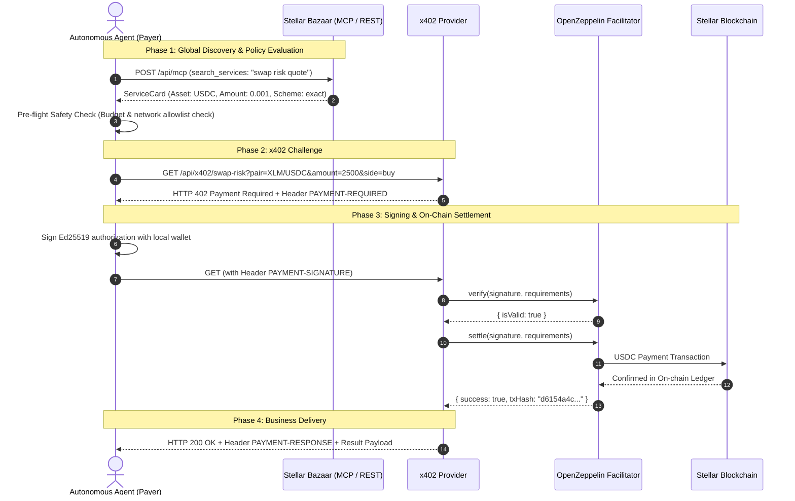

# ✦ Stellar Bazaar x402
### *Universal Machine-Readable Discovery & Atomic x402 Micropayments for the Global AI Agent Economy on Stellar*

<div align="center">

[](README.md)
[](README.es.md)

<br/><br/>



</div>

[](LICENSE)
[](https://stellar.expert/explorer/testnet)
[](https://x402.org)
[](docs/AGENT_QUICKSTART.md)
[](tsconfig.json)
[](https://stellar-bazaar-x402.vercel.app)
[](https://stellar.expert/explorer/testnet)

---

## 🌟 Why It Matters: The Global Agent-to-Agent (A2A) Economy

Autonomous **AI Agents** (Claude, Cursor, LangChain, CrewAI, AutoGen) are rapidly transforming software into an autonomous economy, but they face a **fundamental infrastructure bottleneck**:

> **The Problem:** AI Agents cannot hold human credit cards, cannot commit to $50/month recurring SaaS subscription tiers for single-task executions, and passing master API keys inside LLM prompts creates unacceptable security liabilities.

```
       [ LEGACY HUMAN WEB ]                            [ STELLAR BAZAAR x402 GLOBAL INFRASTRUCTURE ]
 ❌ Monthly human subscription paywalls            ✅ Atomic per-request micropayments (e.g. 0.001 USDC)
 ❌ Master API key leaks in prompt context         ✅ Zero shared secrets; direct cryptographic payment per call
 ❌ Human-centric closed service directories       ✅ Global machine-readable catalog (Streamable MCP + REST)
 ❌ Ambiguous service level agreements             ✅ Deterministic ServiceCards with strict I/O & pricing schemas
 ❌ Custodial middlemen and high fees              ✅ Zero custody: direct on-chain settlement on Stellar
```

**Stellar Bazaar x402** is the **global discovery and payment routing layer** that enables autonomous AI agents and developers worldwide to discover, negotiate, and pay for HTTP APIs and MCP tools on demand, settling instant, low-cost micropayments via the open **x402 standard on the Stellar blockchain**.

---

## 💡 Why Stellar + x402 for the Global Agent Economy?

1. **Sub-second Global Settlement & Micro-fees:** Settle transactions in 3–5 seconds worldwide with near-zero network fees ($0.00001), unlocking viable high-frequency micro-transactions for autonomous agent workflows.
2. **Open Standard HTTP 402:** Clean, standardized `HTTP 402 Payment Required` protocol flow with SEP-41 multi-asset specification (`USDC`, `XLM`, `EURC`).
3. **Native Model Context Protocol (MCP):** Zero-friction tool discovery and consumption for global AI assistants (Claude Desktop, Cursor IDE, Windsurf) and orchestration frameworks (LangChain, CrewAI, AutoGen).
4. **Global by Design with Native Multilingual Intelligence:** Universal machine-readable schemas and semantic discovery supporting international queries with cross-language intent matching.

---

## 🏗️ System Architecture



---

## 🔄 Interaction Flow: Discover, Pay & Execute



---

## 💎 Project Status & Live On-Chain Evidence

### 🟢 Verified On-Chain Settlements (Stellar Testnet)

| # | When | Method | Inner Tx (Soroban) | Ledger | Seller Delta |
|---|------|--------|--------------------|--------|--------------|
| 1 | 2026-08-18 20:36Z | `x402:test-client` | [`43f3ea34…013602`](https://stellar.expert/explorer/testnet/tx/43f3ea344b5ba0f4e0de88237f91c765adc90c110827282320bd3b7aa2013602) | `4212660` | `+0.0010000 USDC` |
| 2 | 2026-08-18 | `x402:test-client` | [`4d6b26ca…86ae11`](https://stellar.expert/explorer/testnet/tx/4d6b26cad5fea174824599467fe885593837517461b72ec7a6e8461e2286ae11) | `4214612` | `+0.0010000 USDC` |
| 3 | 2026-08-18 | `agent:quickstart` | [`5ff5f2d3…a89c2`](https://stellar.expert/explorer/testnet/tx/5ff5f2d34fc09bb9d0b5953c0d6fe9d1a0771f81eee53676b1c47c64e02a89c2) | `4214711` | `+0.0010000 USDC` |
| 4 | 2026-08-19 02:31Z | `agent:quickstart` | [`235d6ffd…87cb49`](https://stellar.expert/explorer/testnet/tx/235d6ffdfd36b27a831668b868014536d47e32128d950c89fd07ed415587cb49) | `4216913` | `+0.0010000 USDC` |
| 5 | 2026-08-19 07:43Z | `agent:quickstart` | [`c7fa7d18…03b625`](https://stellar.expert/explorer/testnet/tx/c7fa7d18d036b19be969d37e393da8a8b8aa9f70dc8e111e4568d90dd903b625) | `4220649` | `+0.0010000 USDC` |

All settlements: `stellar:testnet`, scheme `exact`, `0.001 USDC` (`10000` atomic), SEP-41 contract `CBIELTK6YBZJU5UP2WWQEUCYKLPU6AUNZ2BQ4WWFEIE3USCIHMXQDAMA`, payer [`GC3CK5A4…VDL4`](https://stellar.expert/explorer/testnet/account/GC3CK5A4KCNE44LGMU6PYPEAAZVQOFATJCEMBAASGCXK5EKECTB2VDL4) → recipient [`GDVR2KDK5…RMCQ`](https://stellar.expert/explorer/testnet/account/GDVR2KDK5DSMNYZJKNISUIOBDC6FZK3XZOIQWSS7KL4BRMD5BMW6RMCQ). First settlement additionally recorded its [Outer Fee-Bump tx](https://horizon-testnet.stellar.org/transactions/4498c958c148b98d6b9424168e12eea43352f3bb12a56558d30f50984563f05f) with OpenZeppelin sponsorship (`GA6THKUY...`).

### ✅ Completed & Verified Milestones

1. **Production Deployment (Vercel):**
   * Live at `https://stellar-bazaar-x402.vercel.app` with server-only facilitator key and Upstash Redis persistence in Production + Preview.
   * Interactive Developer Hub (`/docs`) with 1-click code snippets for Claude Desktop MCP, TypeScript SDK, Python LangChain/CrewAI, and cURL.
2. **Streamable HTTP MCP Server (`/api/mcp`, v0.5.0):**
   * 7 read-only tools: `get_bazaar_capabilities`, `list_services`, `search_services`, `get_service`, `validate_service_card`, `list_workflow_bundles`, `get_workflow_bundle`. MCP advertises no registry writes, payment, signing, execution, or custody.
   * `search_services` supports opaque cursor pagination (`limit` 1–50, `nextCursor`, `partialResults`) and deterministic error envelopes (`RESOURCE_NOT_FOUND`, `INVALID_CURSOR`, `BUNDLE_NOT_FOUND`).
   * Provider-registered cards are visible in `list_services`/`search_services`/`get_service` and persist across redeploys via Upstash Redis (provisioned 2026-08-19; verified across production redeploys).
3. **Official Agent SDK & Python Kit (`lib/bazaar-agent-client.ts` & `docs/LANGCHAIN_CREWAI.md`):**
   * Strongly typed discovery/policy SDK. Dynamic paid execution is fail-closed unless the host injects an independent verifier that reconciles receipt network, asset, amount and destination with the selected card.
4. **Dynamic Provider Ingest API & Fast Starter (`/api/publisher/ingest` & `docs/FAST_PROVIDER_START.md`):**
   * Local manifest drafting and deterministic conformance remain public. Registry writes are append-only, server-to-server, disabled by default, and require explicit enablement, durable Redis and an operator credential.
5. **External Provider Contract & E2E Validation:**
   * Truthful contract-only record for independent quote repositories and read-only MCP discovery endpoints. See [external E2E evidence](docs/EXTERNAL_PROVIDER_E2E.md) and [MCP capabilities](docs/MCP_DISCOVERY.md).
6. **6 Global Pilot Bundles:**
   * Agent Governance & Policy (`agent-policy-pilot`), Website Intelligence, Video Repurpose, Campaign Builder, Research Scout, and Design Brief.
7. **Workflow Bundle Schema & Fixtures (read-only):**
   * `bazaar.workflow-bundle/v1` with 20 deterministic rules (19 active for ready/draft fixtures) (cycles, gates, artifacts, price) and 2 fixture bundles. See [WORKFLOW_BUNDLES_FUTURE.md](docs/internal/WORKFLOW_BUNDLES_FUTURE.md).
8. **Automated E2E Test Batteries (zero fund risk):**
   * Ecosystem 5-in-1, MCP onboarding (pagination + hostile corpus), workflow bundles (13 negative cases), agent safety, publisher ingest, external provider CI/mock, and public contract suites.

---

## 🚀 Quickstart

### 1. Installation & Local Run

Requirements: Node.js 22.18+ and npm.

```bash
# Clone the repository
git clone https://github.com/CaBsCrypto/stellar-bazaar-x402.git
cd stellar-bazaar-x402

# Install dependencies
npm install

# Start Next.js development server
npm run dev
```

Open `http://localhost:3000` in your browser.

---

### 2. Run Test Batteries

```bash
# Validate strict TypeScript types (0 errors)
npm run typecheck

# Run Next.js production build
npm run build

# Run ecosystem E2E test suite (REST + MCP + x402, zero fund risk)
npm run test:e2e:ecosystem

# Run MCP onboarding suite (7 read-only tools + mutation rejection)
npm run test:mcp:onboarding

# Run agent policy eval corpus (12 scenarios: hostile metadata, traversal, status fidelity, no secret leaks)
npm run test:agent:policy:evals

# Run reproducible ranking benchmark (golden set, NDCG@3 / MRR / Recall@3 gates)
npm run benchmark:ranking

# Run workflow bundle conformance suite (13 negative cases)
npm run test:workflow:bundle

# Verify registry fail-closed behavior and conformance availability
npm run test:publisher:ingest

# Run deep-hash, retired-payer and receipt-reconciliation invariants
npm run test:security:invariants

# Run autonomous agent safety & budget hard-caps suite
npm run test:agent:safety

# Run external provider contract & mock E2E validation
npm run test:e2e:external

# Run x402 protocol smoke (challenge, capabilities, non-transactional)
npm run test:x402:protocol

# Run public provider contract manifest suite (offline, no funds)
npm run test:contract:external:public

# Run real external provider testnet E2E (requires RUN_EXTERNAL_X402_TESTNET=1 + EXTERNAL_QUOTE_BASE_URL)
npm run test:e2e:external:testnet

# Run read-only agent discovery/policy demo (no payment)
npm run agent:quickstart
```

---

### 3. Connect AI Agents in 3 Lines of Code

```typescript
import { BazaarAgentClient } from "@/lib/bazaar-agent-client";

// 1. Initialize read-only client with policy limits
const client = new BazaarAgentClient({
  baseUrl: "http://localhost:3000",
  maxPriceAllowedUsdc: 0.05,
  allowedAssets: ["USDC"],
});

// 2. Discover target service via MCP tool call
const [serviceCard] = await client.searchServicesMCP("swap risk");

// 3. Inspect only. Paid execution requires a server-only payer plus an
// independent receiptVerifier; a transaction hash alone is never enough.
console.log("Selected card:", serviceCard);
console.log("Stellar Receipt:", execution.payment.receiptUrl);
```

---

## 🛡️ Trust & Security Boundaries

* **Non-Custodial:** Stellar Bazaar never holds, custodies, or escrows user or agent funds.
* **Client-Side Signing Only:** Private keys (`S...`) reside exclusively on local client runtime environments (`server-only`).
* **Zero Secret Leakage:** ServiceCards never contain API keys or secrets.
* **Untrusted Metadata Defense:** Descriptions remain untrusted data; URL/route fields receive deterministic SSRF and traversal checks.
* **Loop Protection Circuit Breakers:** Strict 1-retry payment limit per HTTP request to prevent infinite payment loops.

---

## 🗺️ Roadmap

```
 [ PHASE 1: COMPLETED ]        [ PHASE 2: VALIDATED ]        [ PHASE 3: SECURITY ]        [ PHASE 4: FUTURE ]
  Discovery UI & REST API   --> Testnet x402 Evidence    --> Read-only MCP + SDK      --> Provider ownership + multi-asset
  Streamable MCP Server         Historical on-chain proof     Fail-closed registry       Mainnet only after audit
```

1. ✅ **Phase 1 (Discovery Core):** Global catalog, deterministic lexical ranking, MCP streamable server, and ServiceCard validator.
2. ✅ **Phase 2 (Testnet Settlement):** HTTP 402 challenge, Ed25519 signature verification, and on-chain settlement via `@x402/stellar`.
3. 🟡 **Phase 3 (Security remediation):** read-only MCP, receipt reconciliation gate, canonical deep hashes, retired Testnet payer, and append-only registry disabled by default.
4. ⚪ **Phase 4 (Future):** per-provider ownership, reviewed registry lifecycle, SEP-41 multi-asset work and Mainnet readiness only after external audit.

---

## 📖 Documentation & Guides

* [**Versión en Español (`README.es.md`)**](README.es.md)
* [**Getting Started (`docs/GETTING_STARTED.md`)**](docs/GETTING_STARTED.md)
* [**Agent Integration Quickstart (`docs/AGENT_QUICKSTART.md`)**](docs/AGENT_QUICKSTART.md)
* [**Testnet Reproduction Guide (`docs/DEMO_TESTNET.md`)**](docs/DEMO_TESTNET.md)
* [**Environment Variables Reference (`docs/ENVIRONMENT_VARIABLES.md`)**](docs/ENVIRONMENT_VARIABLES.md)
* [**HTTP API Reference (`docs/HTTP_API_REFERENCE.md`)**](docs/HTTP_API_REFERENCE.md)
* [**MCP Client Setup (`docs/MCP_CLIENT_SETUP.md`)**](docs/MCP_CLIENT_SETUP.md)
* [**Conformance Rules (`docs/CONFORMANCE_RULES.md`)**](docs/CONFORMANCE_RULES.md)
* [**Troubleshooting FAQ (`docs/TROUBLESHOOTING_FAQ.md`)**](docs/TROUBLESHOOTING_FAQ.md)
* [**MCP Agent Onboarding (`docs/MCP_AGENT_ONBOARDING.md`)**](docs/MCP_AGENT_ONBOARDING.md)
* [**MCP Discovery & Capabilities (`docs/MCP_DISCOVERY.md`)**](docs/MCP_DISCOVERY.md)
* [**External Provider E2E Evidence (`docs/EXTERNAL_PROVIDER_E2E.md`)**](docs/EXTERNAL_PROVIDER_E2E.md)
* [**Discovery Contract Specification (`docs/internal/DISCOVERY_CONTRACT.md`)**](docs/internal/DISCOVERY_CONTRACT.md)
* [**Project Architecture Bible (`docs/internal/PROJECT_BIBLE.md`)**](docs/internal/PROJECT_BIBLE.md)
* [**MCP Pagination & P1 Backlog (`docs/internal/MCP_DISCOVERY_BACKLOG.md`)**](docs/internal/MCP_DISCOVERY_BACKLOG.md)
* [**Workflow Bundles Future (`docs/internal/WORKFLOW_BUNDLES_FUTURE.md`)**](docs/internal/WORKFLOW_BUNDLES_FUTURE.md)

> Internal & historical docs (proposals, backlogs, security/QA) live under [`docs/internal/`](docs/internal/).

---

## 📄 License

This project and its documentation are licensed under **[Apache-2.0](LICENSE)**.
Third-party dependencies retain their respective licenses.
