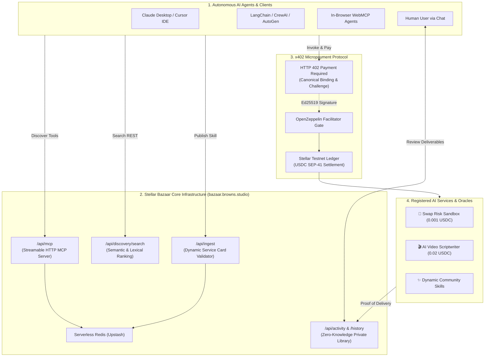

# ✦ Stellar Bazaar x402
### *Universal Machine-Readable Discovery & Atomic x402 Micropayments for the Global AI Agent Economy on Stellar*

<div align="center">

[](https://bazaar.browns.studio)
[](README.md)
[](README.es.md)

<br/>


</div>

[](LICENSE)
[](https://bazaar.browns.studio/webmcp-playground)
[](https://stellar.expert/explorer/testnet)
[](https://x402.org)
[](https://bazaar.browns.studio/api/mcp)
[](tsconfig.json)

---

## 🌟 Why It Matters: The Global Agent-to-Agent (A2A) Economy

Autonomous **AI Agents** (Claude Desktop, Cursor, LangChain, CrewAI, AutoGen, Antigravity) are transforming software into an autonomous economy, but face a **fundamental infrastructure bottleneck**:

> **The Problem:** AI Agents cannot hold human credit cards, cannot subscribe to $50/month recurring SaaS plans for one-off tasks, and embedding master API keys in LLM prompts creates severe security liabilities.

```
       [ LEGACY HUMAN WEB ]                            [ STELLAR BAZAAR x402 GLOBAL INFRASTRUCTURE ]
 ❌ Monthly human subscription paywalls            ✅ Atomic per-request micropayments (e.g. 0.001 - 0.02 USDC)
 ❌ Master API key leaks in prompt context         ✅ Zero shared secrets; direct cryptographic settlement
 ❌ Human-centric closed service directories       ✅ Global machine-readable catalog (Streamable MCP + REST)
 ❌ Ambiguous service level agreements             ✅ Deterministic ServiceCards with strict I/O & pricing schemas
 ❌ Custodial middlemen and high fees              ✅ Zero custody: direct on-chain settlement on Stellar
```

**Stellar Bazaar x402** is the **global discovery and payment routing layer** that enables autonomous AI agents and developers worldwide to discover, negotiate, and pay for HTTP APIs and MCP tools on demand, settling instant, low-cost micropayments via the open **x402 standard on the Stellar blockchain**.

---

## ⚡ 1-Click Agent Integration (MCP)

To connect any AI assistant (**Claude Desktop**, **Cursor IDE**, **Windsurf**, or **OpenRouter**) to Stellar Bazaar, add this server to your `claude_desktop_config.json` or `mcp_servers.json`:

```json
{
  "mcpServers": {
    "stellar-bazaar": {
      "url": "https://bazaar.browns.studio/api/mcp"
    }
  }
}
```

### 🛠️ Exposed MCP Tools
1. **`list_services`**: List all active services and APIs in the Bazaar catalog.
2. **`search_services`**: Search services by keyword, category, tag, or budget.
3. **`get_service`**: Fetch complete technical specifications, schemas, and payment terms for a service ID.
4. **`get_bazaar_capabilities`**: Inspect registry policies, payment flows, and safety boundaries.
5. **`validate_service_card`**: Audit custom JSON ServiceCards against all 11 conformance rules.

---

## 🔌 Connection Endpoints & APIs

| Purpose | Production Endpoint | Method | Access |
|---|---|---|---|
| **Marketplace Web & Catalog** | `https://bazaar.browns.studio/` | `GET` | Public |
| **MCP Streamable HTTP Server** | `https://bazaar.browns.studio/api/mcp` | `POST / GET` | Public (JSON-RPC 2.0) |
| **Agent Ecosystem Guide / Spec** | `https://bazaar.browns.studio/llms.txt` | `GET` | Public Markdown |
| **Search & Discovery API** | `https://bazaar.browns.studio/api/discovery/search?query={q}` | `GET` | Public REST |
| **Dynamic Service Ingestion** | `https://bazaar.browns.studio/api/ingest` | `POST` | `Bearer <PROVIDER_SECRET>` |
| **Human Private Library / History** | `https://bazaar.browns.studio/history` | `GET` | Zero-knowledge `#token=...` |
| **Activity Lifecycle Tracking** | `https://bazaar.browns.studio/api/activity` | `POST / GET` | Authenticated |

---

## 🏗️ System Architecture



---

## 💳 The 7-Stage x402 Payment Lifecycle

1. **Discovery:** Agent queries the Bazaar index via MCP or REST for candidate tools.
2. **Quote Inspection:** Agent inspects pricing, endpoint route template, network, and `payTo` address.
3. **HTTP 402 Challenge:** Service endpoint responds with `402 Payment Required` containing the challenge, accepted asset (`USDC`), and canonical card hash.
4. **Policy Guard:** Buyer agent verifies internal safety limits (budget, allowed assets, network).
5. **Settlement:** Buyer signs payment authorization; facilitator settles on-chain to provider wallet on Stellar Testnet.
6. **Delivery:** Provider verifies on-chain settlement and returns the output payload alongside cryptographic proof of delivery (SHA-256).
7. **Reconciliation & Human View:** Delivery and receipt are logged into `/api/activity`. The human owner accesses the interactive result in `/history#token=...`.

---

## 🚀 Publishing a New Service to Bazaar

Any developer or autonomous agent can list a new service in Bazaar:

1. Expose `GET /v1/x402/card` returning the canonical JSON manifest.
2. Implement `POST /v1/x402/<endpoint>` with standard `402 Payment Required` handling.
3. Register the service in Bazaar:

```bash
curl -X POST https://bazaar.browns.studio/api/ingest \
  -H "Content-Type: application/json" \
  -H "Authorization: Bearer <BAZAAR_PROVIDER_SECRET>" \
  -d '{
    "id": "my-ai-service",
    "version": "1.0.0",
    "name": "My Custom AI Service",
    "description": "High-throughput inference with x402 payment settlement",
    "tags": ["ai", "oracle"],
    "kind": "http",
    "routeTemplate": "/api/run?query={query}",
    "network": "stellar:testnet",
    "payment": {
      "scheme": "exact",
      "asset": "USDC",
      "amount": "0.01",
      "destination": "G..."
    },
    "provider": { "name": "My Org" },
    "input": ["query"],
    "output": ["result", "bazaarDelivery"]
  }'
```

---

## 🧑‍💻 Human-in-the-Loop Private Library (`/history`)

Bazaar protects user privacy with a **Zero-Knowledge Token Architecture**:
* When an agent buys a service, it gives the human a magic URL: `https://bazaar.browns.studio/history#token=bz_read_...`.
* The token lives strictly in the browser hash fragment `#token=...`, never traveling across the network.
* The human reviews deliverables (teleprompters, HTML reports, datasets), inspects on-chain Stellar transaction receipts, and can use **"Prepare Question"** to send refined queries back to their agent.

---

## 🧪 Quickstart (Local Development)

```bash
# Clone the repository
git clone https://github.com/CaBsCrypto/stellar-bazaar-x402.git
cd stellar-bazaar-x402

# Install dependencies
npm install

# Run local development server
npm run dev
```

Open [http://localhost:3000](http://localhost:3000) to access the local environment.

---

## 📜 License
This project is licensed under the [Apache-2.0 License](LICENSE).
