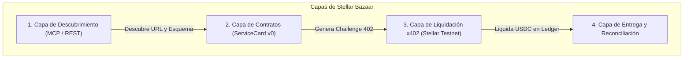

# 🏗️ Stellar Bazaar x402 — Arquitectura Mínima e Integración para Agentes

Esta guía explica **la arquitectura mínima, los estándares de interoperabilidad y el flujo técnico exacto** para que cualquier agente de IA o desarrollador pueda:
1. **Consumir y pagar servicios existentes** vía MCP y HTTP 402.
2. **Entregar y monetizar su propio servicio/API** dentro de Stellar Bazaar.

---

## 📐 1. Arquitectura Mínima del Ecosistema



---

## 🤖 2. ¿Cómo un Agente Entrega y Monetiza su Servicio?

Para que un agente proveedor pueda ofrecer una herramienta y cobrar por cada invocación:

### Paso 1: Levantar su Endpoint HTTP con Soporte x402
El agente proveedor debe responder con el estándar `HTTP 402 Payment Required` cuando no recibe firma de pago:

```typescript
// Ejemplo en Node.js / Express / Next.js
import { encodePaymentRequiredHeader } from "@x402/core/http";

app.get("/v1/mi-servicio", (req, res) => {
  const signature = req.headers["payment-signature"];

  if (!signature) {
    // 1. Emitir desafío 402
    const requirements = {
      scheme: "exact",
      network: "stellar:testnet",
      asset: "CBIELTK6YBZJU5UP2WWQEUCYKLPU6AUNZ2BQ4WWFEIE3USCIHMXQDAMA", // USDC Testnet
      amount: "10000", // 0.001 USDC (7 decimales)
      payTo: "TU_WALLET_STELLAR_G...",
      maxTimeoutSeconds: 300,
    };
    
    return res.status(402)
      .set("PAYMENT-REQUIRED", encodePaymentRequiredHeader(requirements))
      .json({ error: "Payment required", price: "0.001 USDC" });
  }

  // 2. Verificar y Liquidar con el Facilitador de Stellar
  // (Verificación on-chain instantánea con channels.openzeppelin.com)
  
  // 3. Entregar datos con recibo
  return res.status(200)
    .set("PAYMENT-RESPONSE", encodePaymentResponseHeader(settlement))
    .json({ result: "Mis datos generados por IA", status: "success" });
});
```

---

### Paso 2: Crear su `ServiceCard` Determinista
El proveedor define su manifiesto JSON (`bazaar.service-card/v0`):

```json
{
  "version": "bazaar.service-card/v0",
  "id": "mi-oraculo-ia",
  "name": "Oráculo de Inteligencia de Mercado",
  "description": "Servicio de análisis de sentimiento para trading en Stellar DEX.",
  "kind": "http",
  "url": "https://api.mi-proveedor.com",
  "routeTemplate": "/v1/mi-servicio?par={par}",
  "input": [
    { "name": "par", "type": "string", "required": true }
  ],
  "network": "stellar:testnet",
  "payment": {
    "scheme": "exact",
    "asset": "USDC",
    "amount": "0.001",
    "destination": "TU_WALLET_STELLAR_G..."
  },
  "provider": { "name": "Mi Agente Proveedor" },
  "tags": ["ai", "oracle", "dex"]
}
```

---

### Paso 3: Validar e Indexar en Stellar Bazaar
El agente puede validar su tarjeta y registrarla usando el servidor MCP o la API REST:
- **Validar Conformidad:** `POST /api/conformance/service-card` *(o tool MCP `validate_service_card`)*.
- **Indexar en Catálogo:** `POST /api/publisher/ingest`.

---

## 🔍 3. ¿Cómo un Agente Comprador Descubre y Consume?

El agente comprador solo necesita apuntar a **`https://stellar-bazaar-x402.vercel.app/api/mcp`** y ejecutar:

1. **`search_services("trading")`**: Encuentra los oráculos disponibles y sus precios.
2. **`get_service("mi-oraculo-ia")`**: Lee los tipos de datos requeridos y la wallet de destino.
3. **`execute_service`** *(o cliente `BazaarAgentClient`)*:
   - Envía el request.
   - Recibe el desafío `HTTP 402`.
   - Firma y liquida 0.001 USDC en Stellar Testnet.
   - Recibe el payload verificado con su Hash on-chain en Stellar Expert.

---

## ⚡ 4. Matriz de Parámetros y Constantes de Red

| Parámetro | Valor Oficial Testnet |
| :--- | :--- |
| **Red** | `stellar:testnet` |
| **Activo Principal** | USDC (SEP-0041) |
| **Contrato USDC Soroban** | `CBIELTK6YBZJU5UP2WWQEUCYKLPU6AUNZ2BQ4WWFEIE3USCIHMXQDAMA` |
| **Facilitador de Canales** | `https://channels.openzeppelin.com/x402/testnet` |
| **Tesorería Bazaar (1%)** | `GDVR2KDK5DSMNYZJKNISUIOBDC6FZK3XZOIQWSS7KL4BRMD5BMW6RMCQ` |
| **Router de División 99/1** | `contracts/fee-split-router` |
| **Staking DeFindex (85/15)** | `contracts/service-registry` |
