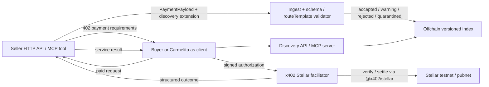
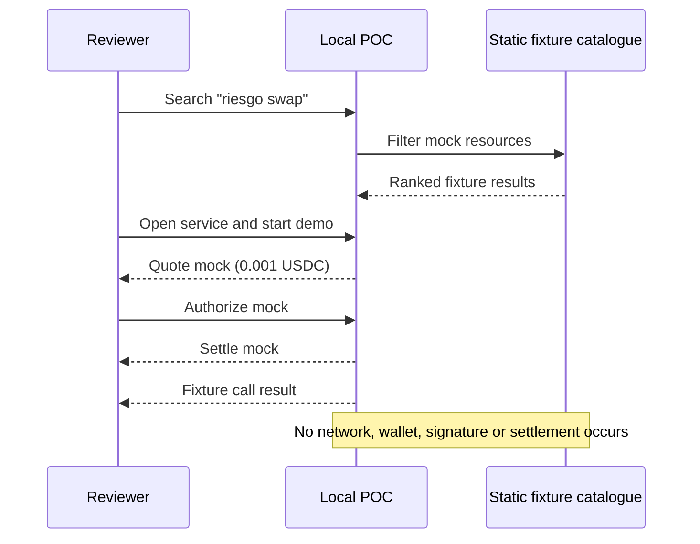
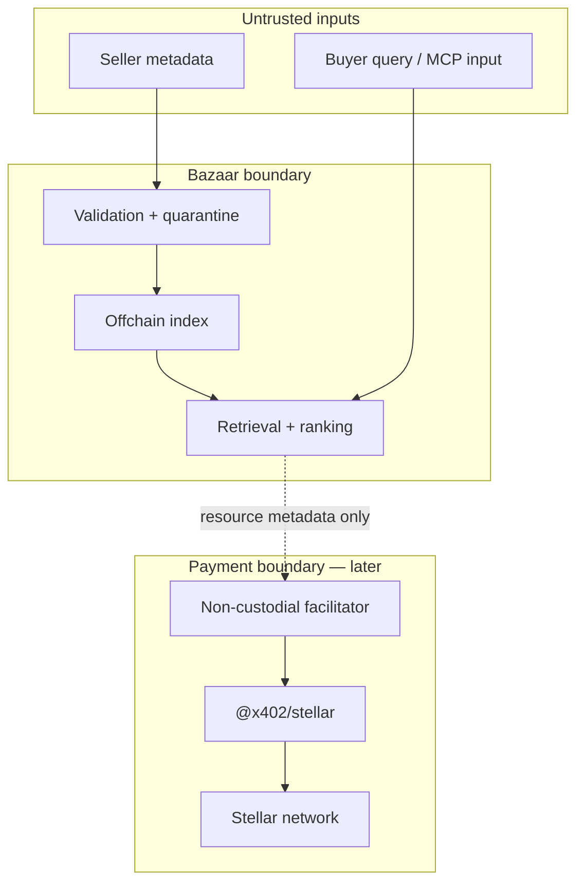

# Arquitectura y flujos

## Producto objetivo

El Bazaar no firma ni custodia fondos. El facilitator es un límite separado; `@x402/stellar` conserva la responsabilidad protocolaria de verify/settle.

## Flujo demostrado en el POC

## Trust boundaries

