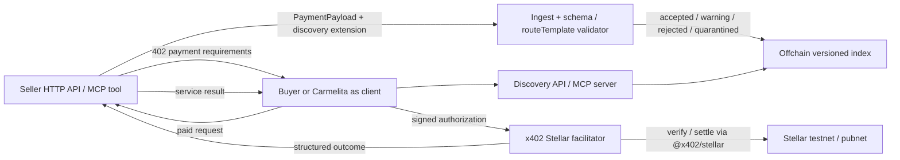
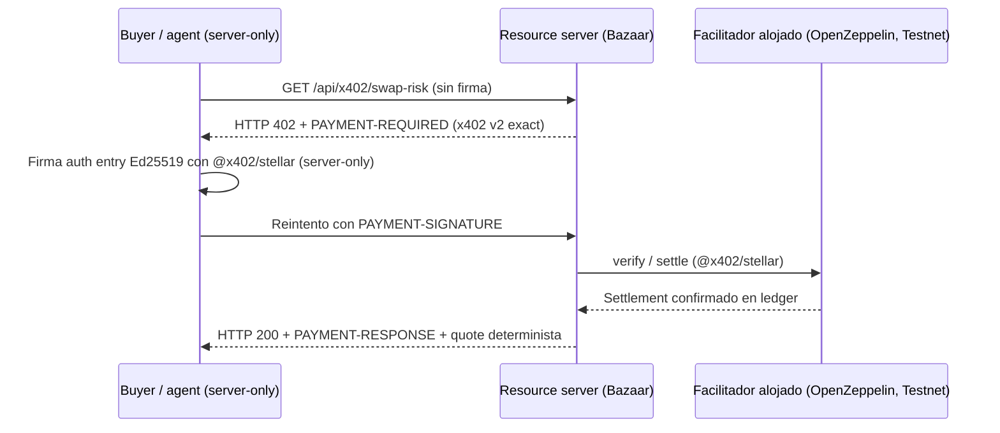
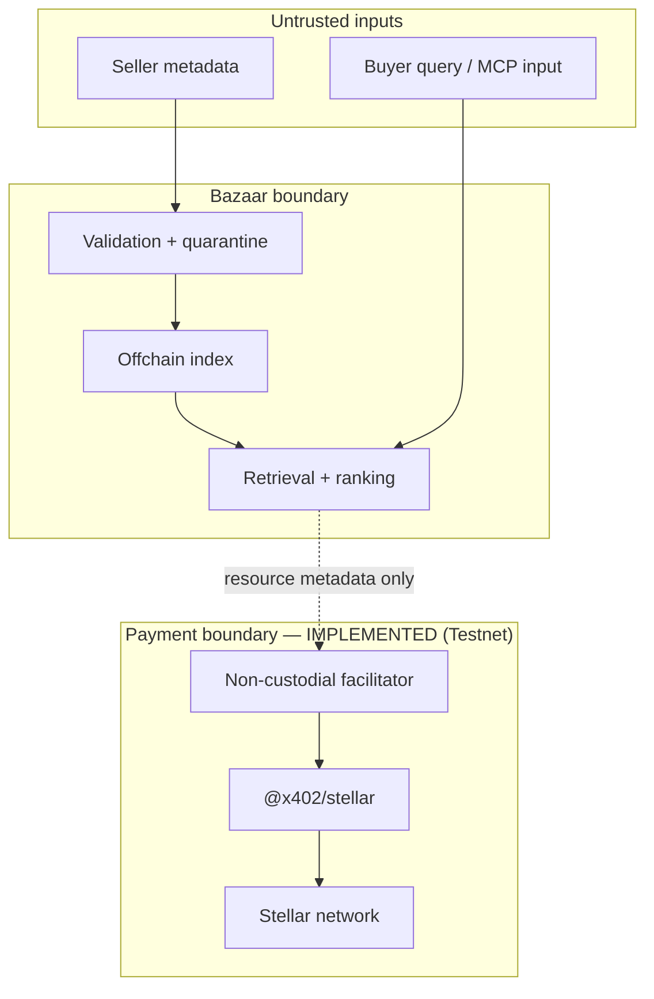

# Arquitectura y flujos

## Producto objetivo

El Bazaar no firma ni custodia fondos. El facilitator es un límite separado; `@x402/stellar` conserva la responsabilidad protocolaria de verify/settle.

## Flujo x402 implementado (Testnet)

Flujo verificado en Testnet: 3 settlements confirmados (evidencia en README, ledgers `4212660`/`4214612`/`4214711`). El Bazaar no firma ni custodia fondos: la firma ocurre server-only en el cliente del comprador; verify/settle los ejecuta el facilitador alojado.

## Trust boundaries

