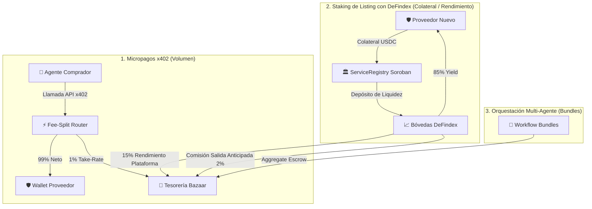

# 💎 Stellar Bazaar — Monetization, Fee-Split & DeFindex Staking Plan

> **Estado:** Documento de Arquitectura y Plan de Activación (v1.0).
> Define los modelos de ingresos, la activación del split de comisiones no custodiales y la integración de staking colateralizado vía DeFindex.

---

## 🌟 1. Modelo de Negocio Integral

Stellar Bazaar genera ingresos mediante tres vertientes complementarias y no custodiales:

---

## 💸 2. Fuentes de Monetización

### A. Take-Rate en Micropagos (100 BPS / 1%)
- **Mecanismo:** En cada llamada x402, el pago bruto se divide atómicamente en una sola transacción:
  - **99%** directo al proveedor del oráculo/API.
  - **1%** a la Tesorería de Stellar Bazaar (`GDVR2KDK5DSMNYZJKNISUIOBDC6FZK3XZOIQWSS7KL4BRMD5BMW6RMCQ`).
- **Invariante:** Cero custodia intermedia. La operación es 100% atómica.

### B. Staking de Listing con DeFindex (Interoperabilidad DeFi + Monetización Pasiva)
Para publicar un servicio en estado **Verificado** con máxima prioridad en el ranking MCP:
1. **Depósito en Bóveda:** El proveedor deposita colateral (ej. 50-100 USDC) que el contrato de Soroban envía automáticamente a una estrategia de liquidez en **DeFindex Vaults**.
2. **Reparto del Yield Anual (85% / 15% - Competitivo y Atractivo):**
   - **85% del rendimiento:** Acreditado directamente al proveedor (garantiza una rentabilidad atractiva por tener su API listada).
   - **15% Performance Fee:** Transferido periódicamente a la Tesorería de Stellar Bazaar como ingreso pasivo de plataforma.
3. **Exit / Unbonding Fee:** Si el proveedor retira su stake antes del período mínimo (ej. 30 días), se aplica una penalización del **2%** en favor de la plataforma.
4. **Slashing por Incumplimiento de SLA:** Si el oráculo reporta caídas o entrega datos corruptos validados por pruebas de desafío, parte del stake es penalizada.

---

## 🗺️ 3. Roadmap Técnico de Activación por Fases

### 🔹 Fase 1: Smart Contracts en Soroban (contracts/)
- [ ] **`FeeSplitRouter` Soroban Contract:**
  - Invocación atómica multi-transferencia de SEP-41 USDC (`99% provider` / `1% treasury`).
  - Pruebas unitarias en Rust con Soroban SDK.
- [ ] **Extensión `ServiceRegistry` con DeFindex Interface:**
  - Métodos `stake_and_publish()` y `withdraw_stake()`.
  - Integración con el ABI de las bóvedas de DeFindex en Testnet.

### 🔹 Fase 2: Adaptador x402 y SDK Cliente (lib/)
- [ ] **Extensión de Desafío x402:** Anuncio de esquema `split-exact` en la cabecera `PAYMENT-REQUIRED`.
- [ ] **Actualización de `BazaarAgentClient`:** Firma de invocaciones atómicas hacia el router y verificación de doble recibo.

### 🔹 Fase 3: Portal de Publicación UI y Activación en Testnet
- [ ] **Selector de Nivel en `/publish`:**
  - *Tier Sandbox (Gratis):* Borrador local con límites de tasa.
  - *Tier Verificado (DeFindex Stake):* Depósito de colateral vía Freighter Wallet o Agente.
- [ ] **Prueba E2E Integral:** Validación del flujo completo con depósito en DeFindex y liquidación de llamadas con split.

---

## 🔒 4. Invariantes de Seguridad y Cumplimiento
- **No-Custodia:** Ningún contrato de Bazaar retiene fondos ni custodia claves privadas.
- **Fail-Closed:** Toda transacción que no concilie exactamente los montos o falle en una de las rutas es revertida en su totalidad.
- **Transparencia Total:** Toda comisión y condición de staking es visible tanto en las ServiceCards como en los endpoints MCP (`/api/mcp` y `/api/webmcp/spec`).
