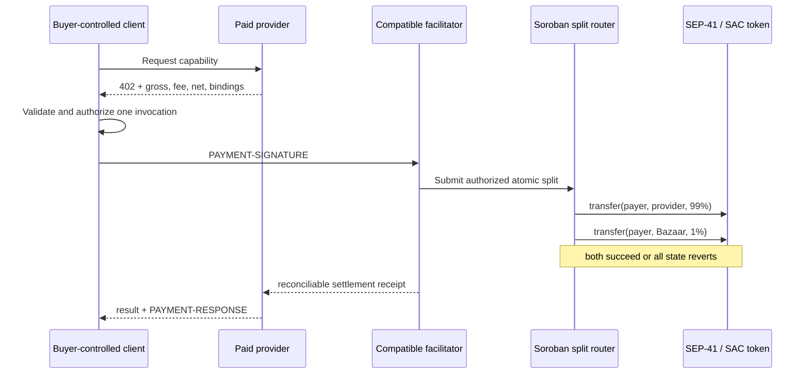

# Comisión no custodial / Non-custodial fee split

> **Estado: diseño v0; no activo.** No existe contrato desplegado, mecanismo x402 compatible, comisión en producción ni pago asociado a este documento. Testnet únicamente durante validación.

## Decisión de producto

El comprador paga el precio bruto publicado. El valor predeterminado es 1%: el proveedor recibe 99% y Bazaar 1%. La política permite configurar la comisión entre 1 y 500 bps (0,01%–5%) para futuras condiciones comerciales, pero el porcentaje queda fijado e inmutable en la Service Card, la cotización y la autorización de cada compra. Bazaar no guarda llaves, no firma por el comprador y no retiene fondos.

The buyer pays the displayed gross price. The default fee is 1%: 99% goes to the provider and 1% to Bazaar. Policy may configure 1–500 bps (0.01%–5%) for future commercial terms, but the rate is immutable within each Service Card, quote and buyer authorization. Bazaar never holds keys, signs for the buyer, or retains funds.

Ejemplo para el precio actual de 0.001 USDC (7 decimales):

| Concepto | Atomic | USDC |
|---|---:|---:|
| Precio bruto / Gross | 10,000 | 0.0010000 |
| Proveedor / Provider (99%) | 9,900 | 0.0009900 |
| Bazaar (1%) | 100 | 0.0000100 |

La versión v0 rechaza importes que exijan redondeo. `provider + Bazaar` debe ser exactamente igual al precio bruto.

## Arquitectura propuesta

El router no recibe primero el saldo ni lo reenvía después. Dentro de una sola invocación autorizada realiza dos llamadas anidadas al contrato del token. Si una falla, la operación completa debe revertirse. La política canónica liga red, activo, precio bruto, basis points, ambos destinos, request binding y hash de Service Card.

## Brecha x402 confirmada que bloquea activación

El esquema `exact` usado actualmente anuncia un único `payTo`. La auditoría del SDK fijado (`@x402/stellar` 2.24.0) confirmó que el cliente construye una sola invocación SEP-41 `transfer(payer, payTo, amount)` y el verificador exige exactamente esa función, esos tres argumentos y una sola transferencia. También rechaza explícitamente una simulación con múltiples transferencias. Un `payTo` con dirección de contrato solo deposita en ese contrato; no invoca su función de reparto.

Por tanto, el router 99/1 **no es compatible con el mecanismo `exact` estándar actual**. El pago directo 100% al proveedor continúa siendo la única ruta activa y demostrada. No se debe apuntar `payTo` al router, encadenar dos pagos ni hacer una remesa posterior: ninguna de esas alternativas demuestra un reparto atómico y no custodial.

Por tanto, la integración permanece **fail-closed** hasta tener una de estas rutas revisada y conformance-tested:

1. una extensión/mecanismo Stellar x402 formal que describa y verifique el split; o
2. un adaptador de facilitador que inspeccione estrictamente la invocación del router y sus auth entries.

No reimplementaremos `/verify` o `/settle`, ni afirmaremos compatibilidad upstream antes de pruebas contra la implementación oficial.

## Invariantes de seguridad

- Stellar Testnet y el contrato SAC de USDC Testnet fijados durante el POC; símbolos libres o activos vacíos son rechazados. Mainnet queda bloqueado.
- Comisión predeterminada de 100 bps y máximo técnico de 500 bps; visible y ligada criptográficamente antes de autorizar.
- El proveedor acepta términos versionados mediante `providerTermsHash`; cambiar la comisión exige una política/cotización nueva y nunca altera compras pendientes o recibos históricos.
- Proveedor y tesorería son cuentas distintas y fijadas por la política.
- Una transacción, exactamente dos asignaciones y suma exacta al bruto.
- Autorización ligada a método, ruta, input, Service Card, activo, monto, destinos y expiración.
- El router no conserva balance ni expone una función de retiro administrativo.
- Replays, expiración, destino/activo/monto alterado o recibo inconsistente fallan cerrado.
- El resultado del proveedor se reconcilia con request, Service Card, pago y receipt; un tx hash solo no demuestra entrega.
- Logs, UI y recibos nunca incluyen seeds, claves del facilitador ni payload de autorización completo.

## Política canónica v1 y evidencia

La política local v1 liga explícitamente red, esquema, SAC, router, pagador, proveedor, tesorería, bruto, comisión, método, ruta, hash de input, hash de Service Card, nonce y expiración de ledger. Cualquier mutación invalida `requestBinding`.

La reconciliación ya no confía en banderas declaradas como `atomic: true` o `routerRetainedFunds: false`. Exige evidencia normalizada de exactamente dos efectos de ledger —pagador a proveedor y pagador a Bazaar— y un delta cero del router. Esto sigue siendo un modelo local: antes de afirmar settlement, un futuro adaptador deberá obtener y validar esos efectos desde Stellar RPC/Horizon y el evento del contrato.

Gate fail-closed pendiente:

- constructor/despliegue atómico o configuración stateless para impedir front-running de inicialización;
- inspección completa del árbol de autorización y argumentos de ambas transferencias;
- expiración estricta (`expiresLedger <= currentLedger` falla), replay concurrente y TTL;
- pinning del router y SAC USDC desplegados, con bytecode revisado;
- mecanismo x402/facilitador que soporte el router de manera explícita;
- reconciliación independiente de transacción, evento, efectos y balances.

## Alternativas rechazadas

- **Pagar al router y reenviar después:** introduce custodia y riesgo operativo.
- **Dos pagos x402 independientes:** no ofrece atomicidad; uno podría liquidar sin el otro.
- **Cobro posterior al proveedor:** no garantiza la comisión y complica conciliación.
- **Escrow general:** resuelve entrega diferida, no la comisión de una llamada síncrona, y exige otro perfil de seguridad/legal.

## Gate de implementación

1. **P0 — rama actual:** política canónica v1, cálculo determinista, reconciliación basada en evidencia y pruebas negativas sin red. No activa comisión.
2. **P1 — branch de contrato:** router Soroban mínimo, sin admin withdrawal; unit, property y fuzz tests; eventos y errores deterministas.
3. **P2 — conformance:** revisión independiente de auth entries, expiración y replay; definir el mecanismo x402/facilitador soportado; testnet deployment separado.
4. **P3 — evidencia:** una operación mínima autorizada, verificación de balances, ledger, receipt y entrega; luego repetibilidad.
5. **Mainnet:** solamente tras auditoría externa, revisión operacional y decisión legal/comercial explícita.

Escrow seguirá en un branch y especificación separados para servicios asíncronos o con aprobación. No forma parte de este diseño.
