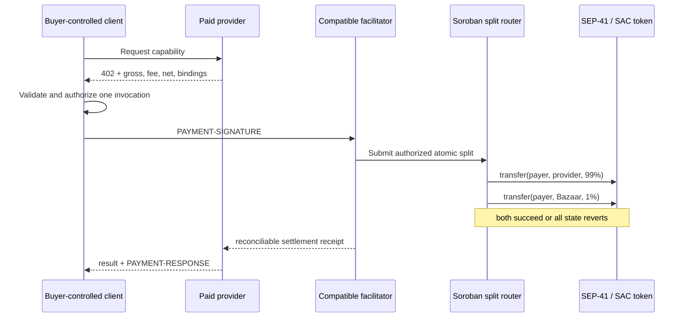

# Comisión no custodial / Non-custodial fee split

> **Estado: diseño v0; no activo.** No existe contrato desplegado, mecanismo x402 compatible, comisión en producción ni pago asociado a este documento. Testnet únicamente durante validación.

## Decisión de producto

El comprador paga el precio bruto publicado. El proveedor conoce y acepta que Bazaar descuente 1% de su ingreso: 99% va directamente al proveedor y 1% directamente a la tesorería pública de Bazaar. Bazaar no guarda llaves, no firma por el comprador y no retiene fondos.

The buyer pays the displayed gross price. The provider knowingly accepts a 1% Bazaar fee: 99% goes directly to the provider and 1% directly to Bazaar's disclosed treasury. Bazaar never holds keys, signs for the buyer, or retains funds.

Ejemplo para el precio actual de 0.001 USDC (7 decimales):

| Concepto | Atomic | USDC |
|---|---:|---:|
| Precio bruto / Gross | 10,000 | 0.0010000 |
| Proveedor / Provider (99%) | 9,900 | 0.0009900 |
| Bazaar (1%) | 100 | 0.0000100 |

La versión v0 rechaza importes que exijan redondeo. `provider + Bazaar` debe ser exactamente igual al precio bruto.

## Arquitectura propuesta

El router no recibe primero el saldo ni lo reenvía después. Dentro de una sola invocación autorizada realiza dos llamadas anidadas al contrato del token. Si una falla, la operación completa debe revertirse. La política canónica liga red, activo, precio bruto, basis points, ambos destinos, request binding y hash de Service Card.

## Brecha x402 que bloquea activación

El esquema `exact` usado actualmente anuncia un único `payTo`. Un router con dos transferencias no se debe presentar como compatible solo por generar una transacción válida: comprador, servidor y facilitador deben soportar explícitamente el mecanismo `(scheme, network)` y verificar la invocación completa.

Por tanto, la integración permanece **fail-closed** hasta tener una de estas rutas revisada y conformance-tested:

1. una extensión/mecanismo Stellar x402 formal que describa y verifique el split; o
2. un adaptador de facilitador que inspeccione estrictamente la invocación del router y sus auth entries.

No reimplementaremos `/verify` o `/settle`, ni afirmaremos compatibilidad upstream antes de pruebas contra la implementación oficial.

## Invariantes de seguridad

- Stellar Testnet y USDC fijados durante el POC; Mainnet queda bloqueado.
- Comisión v0 fija en 100 bps; visible antes de autorizar.
- Proveedor y tesorería son cuentas distintas y fijadas por la política.
- Una transacción, exactamente dos asignaciones y suma exacta al bruto.
- Autorización ligada a método, ruta, input, Service Card, activo, monto, destinos y expiración.
- El router no conserva balance ni expone una función de retiro administrativo.
- Replays, expiración, destino/activo/monto alterado o recibo inconsistente fallan cerrado.
- El resultado del proveedor se reconcilia con request, Service Card, pago y receipt; un tx hash solo no demuestra entrega.
- Logs, UI y recibos nunca incluyen seeds, claves del facilitador ni payload de autorización completo.

## Alternativas rechazadas

- **Pagar al router y reenviar después:** introduce custodia y riesgo operativo.
- **Dos pagos x402 independientes:** no ofrece atomicidad; uno podría liquidar sin el otro.
- **Cobro posterior al proveedor:** no garantiza la comisión y complica conciliación.
- **Escrow general:** resuelve entrega diferida, no la comisión de una llamada síncrona, y exige otro perfil de seguridad/legal.

## Gate de implementación

1. **P0 — este branch:** política canónica, cálculo determinista, reconciliación, UI y pruebas sin red.
2. **P1 — branch de contrato:** router Soroban mínimo, sin admin withdrawal; unit, property y fuzz tests; eventos y errores deterministas.
3. **P2 — conformance:** revisión independiente de auth entries, expiración y replay; definir el mecanismo x402/facilitador soportado; testnet deployment separado.
4. **P3 — evidencia:** una operación mínima autorizada, verificación de balances, ledger, receipt y entrega; luego repetibilidad.
5. **Mainnet:** solamente tras auditoría externa, revisión operacional y decisión legal/comercial explícita.

Escrow seguirá en un branch y especificación separados para servicios asíncronos o con aprobación. No forma parte de este diseño.
