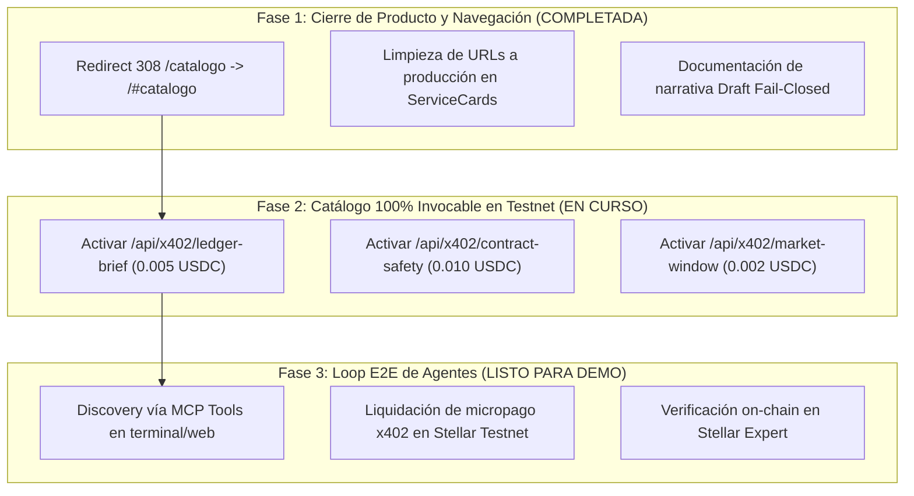

# 🎯 Stellar Bazaar x402 — Plan Integral de Cierre de Producto y Flujos E2E

Este documento consolida el plan de acción técnico y de producto derivado de la auditoría y feedback del agente externo en `https://stellar-bazaar-x402.vercel.app`.

---

## 📌 Diagnóstico del Feedback del Agente

| Área Auditada | Estado Observado | Decisión y Enfoque de Producto |
| :--- | :--- | :--- |
| **Descubrimiento & Búsqueda** | Funciona al 100% con búsqueda léxica y 8 herramientas MCP. | ✅ Mantener optimizado con Edge Cache (S-Maxage) y Singleton. |
| **Publicación (`/publish`)** | Ingest 503 por política estricta de seguridad. | ✅ **Fail-Closed por Diseño**: `/publish` opera como Kit de Autoría y Borrador Local (Draft). No se indexa sin revisión manual anti-spam. |
| **Navegación & URLs** | `/catalogo` daba 404 (era `/#catalogo`) y referencias a `localhost`. | ✅ **Resuelto**: Redirect 308 `/catalogo -> /#catalogo` y URLs limpias hacia `stellar-bazaar-x402.vercel.app`. |
| **Cobro y Liquidación x402** | Solo `Swap Risk Quote` activo; el resto era fixture. | 🔄 **Acción**: Expandir a 4 servicios ejecutables en vivo con cobro real en Stellar Testnet. |

---

## 🗺️ Fases del Plan de Ejecución

---

## 🛠️ Detalle de los 4 Servicios Invocables en Vivo

1. **`Swap Risk Quote`** (`/api/x402/swap-risk`)
   - **Precio:** 0.001 USDC
   - **Función:** Estima profundidad, slippage y riesgo de ruta en pares DEX de Stellar.
2. **`Stellar Ledger Brief`** (`/api/x402/ledger-brief`)
   - **Precio:** 0.005 USDC
   - **Función:** Analiza transacciones y eventos recientes de una cuenta/contrato en Testnet Horizon.
3. **`Soroban Contract Safety Scan`** (`/api/x402/contract-safety`)
   - **Precio:** 0.010 USDC
   - **Función:** Escanea bytecode y árboles de autorización de contratos Soroban.
4. **`Market Window DEX Depth`** (`/api/x402/market-window`)
   - **Precio:** 0.002 USDC
   - **Función:** Entrega snapshots de orderbook y spreads en tiempo real.

---

## 🎬 Guion de Demostración para Video y Jurado

1. **Paso 1 (Descubrimiento):**
   - El agente o usuario abre el catálogo o ejecuta `search_services("defi")` en MCP.
   - Recibe la lista estructurada con precios, rutas y esquemas de entrada.
2. **Paso 2 (Publicación / Draft):**
   - Mostrar `/publish` explicando el formulario: *"Diseño y validación de ServiceCard con 11 reglas. Queda en estado Draft local (no indexado sin prueba de control y staking)"*.
3. **Paso 3 (Consumo y Liquidación en Vivo):**
   - Ejecutar la llamada x402 contra el endpoint.
   - Mostrar el desafío `HTTP 402 Payment Required`.
   - Mostrar la liquidación en Stellar Testnet y el link al explorador con el Hash de transacción real del día.
