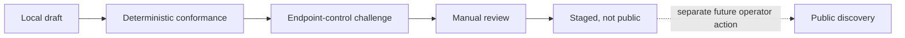

# Guarded provider self-listing / Alta controlada de proveedores

This MVP adds a **draft intake**, not open publication. It accepts a conformant Service Card only when an operator explicitly enables `BAZAAR_ENABLE_SELF_LISTING_INTAKE=true`. The default is fail-closed.

## Lifecycle

`awaiting-control-proof → pending-manual-review → approved-for-staging → staged-not-public` is the only approval path. Rejection and expiry are terminal. Staging is deliberately a separate in-memory map and is **never read by public discovery**. There is no public activation endpoint.

## Control-proof abstraction

- `dns-txt`: publish the issued `stellar-bazaar-verification=…` value as DNS TXT for the exact Service Card hostname.
- `http-well-known`: serve that value at `/.well-known/stellar-bazaar-provider.txt` on the exact hostname.
- Localhost, IP literals, malformed domains and parent/sibling-domain claims are rejected.
- The current branch issues the challenge but intentionally exposes no public verifier. A trusted operator adapter must fetch DNS/HTTPS with SSRF-safe resolution, redirect limits and private-address blocking before recording a result.

Control proves only the ability to publish at a hostname. It does not certify identity, safety, availability, reputation, prices or results.

## HTTP surface

- `POST /api/provider-self-listing`: max 32 KiB JSON `{card, controlProof:{method,domain}}`; returns `202` and a public challenge when enabled.
- `GET /api/provider-self-listing/{submissionId}`: sanitized lifecycle status, no full submitted card.
- `GET /api/provider-self-listing`: `405`; the review queue is private.
- There are no public proof-result, review, staging or activation routes.

The queue is process-local, capped at 100 and expires entries after 24 hours. It is suitable for a guarded local/pilot review only—not production durability. Multi-instance production intake remains disabled until an atomic durable queue, authenticated least-privilege reviewer roles, audit trail, rate limits and SSRF-safe verification exist.

## Boundaries

No wallet, payment, seed, API key, signing, custody or provider result passes through this workflow. Submitted metadata remains untrusted data. Approval only permits non-public staging; indexing requires a later, separate operator-controlled release process.
