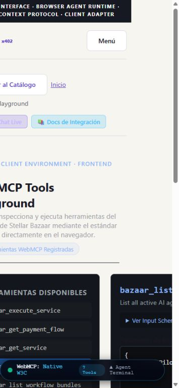
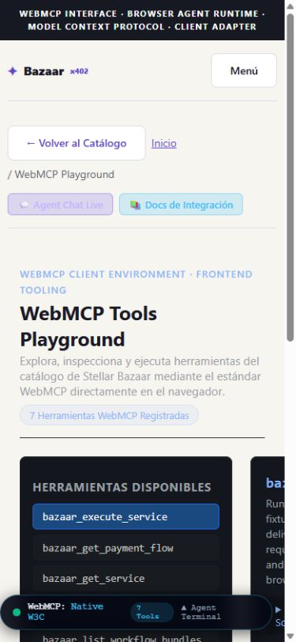

# Base/WebMCP review — 2026-09-27

Base origin/main: 76ba7b19eacb424d8c9e872a2d01569e1eb45b3d. Code reviewed: d6bf4f5. References145e662/27fb7a2, isolated from payment/identity/discovery changes.

Node22.18.0: typecheck, build (`npm run build -- --webpack`), test:history, test:agent-chat (legacy, corrected in next PR), test:payment-flow, test:webmcp:conformance, test-private-webmcp, and test-webmcp-{lifecycle,native-lifecycle,async-discovery}. All PASS. Node24.14 initial checks also pass. Native/async/lifecycle/conformance independently reproduced by a non-author reviewer.

Windows uses a node_modules junction outside the checkout; default Turbopack rejects that layout. Webpack build passed without source configuration changes. Clean Linux CI keeps Node22 and npm ci / npm run build. Existing metadataBase warning remains. security:scan reports no current/build secrets and one known historical commit; no history rewritten.

Browser:390x844 and1366x768; chat and library navigation checked. Production build localhost3222 exposes7 native tools, including after client navigation; direct playground entry and read-only list_services execution PASS with SUCCESS activity. No provider/payment execution. Foreign preexisting tools, partial failure and remount tested with doubles for navigator/document; asynchronous enumeration supported. Replacement of a tool by an outside actor after an async snapshot is not independently established by these tests.

Vercel read-only UI confirmed repository link, root directory, main production76ba7b1 and no deploy hooks. Exact branches review/base-webmcp and review/history-identity are disabled in vercel.json before push. Other branches/settings unchanged. Official configuration: https://vercel.com/docs/project-configuration/git-configuration (consulted2026-09-27). GitHub main has no branch protection/rulesets; CI is extended only to the stacked Base target. Draft status is not used as deployment protection.
