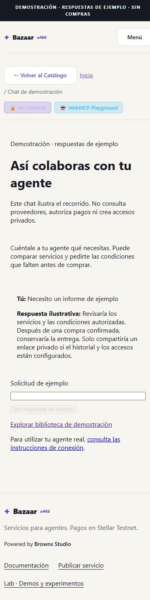
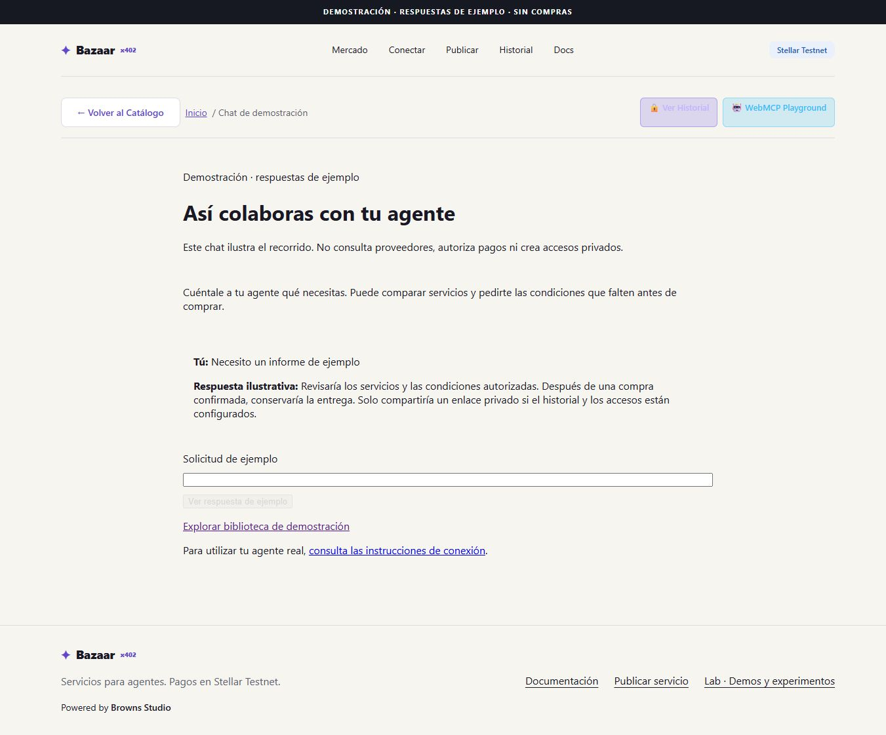
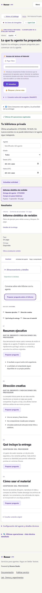
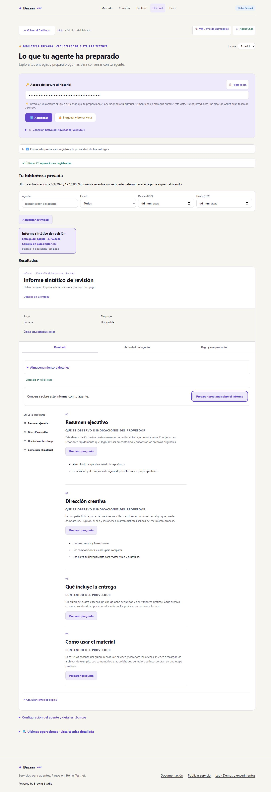

# Identity review — 2026-09-27

Depends on review/base-webmcp. Identity code059eeee, derived from0f335f4 with repository-path rejection and explicit chat-demo page labels. Subsequent rebase adds Base documentation only.

Node22.18: typecheck, build `npm run build -- --webpack`, test:history, test:agent-chat (includes provisioning), test:webmcp:conformance, test:payment-flow, and all three WebMCP lifecycle tests PASS. security:scan no current/build secrets; known historical finding unchanged. Windows junction/Turbopack limitation as in BASE.md. An initially mistyped test filename failed to resolve; rerun with scripts/test-webmcp-async-discovery.mjs passed.

Non-author reviewer reproduced provisioning/chat on Node22 and approved auth, path handling, page copy and isolated harness. Additional dynamic ACL/junction inspection was denied by approval review; not claimed as verified. Existing provisioning tests passed; ACL setup and realpath handling reviewed statically.

Browser390x844/1366x768: chat example by keyboard; private synthetic delivery; password-masked access; hash removal; Escape returns focus; lock removes content/draft; original fixture link restores the delivery. No horizontal overflow observed. No real keys, Redis, object storage or payment used.

Reproduce: start built Next on127.0.0.1:3211; `node scripts/serve-history-review.mjs` exposes loopback3212. Fixture credentials are public test constants in that script, not live access. Harness prepares operation+delivery through real HTTP handlers, uses an in-memory double, blocks unrelated APIs. `/api`, `/%61pi/operations` and `/api/x402/swap-risk` return403. This does not establish external persistence.

Configured historical accounts remain supported. Unregistered legacy links fail explicitly; no guessing owners or granting access through a client-provided ownerId. No public provisioning endpoint. No new payment assets or deployment.
